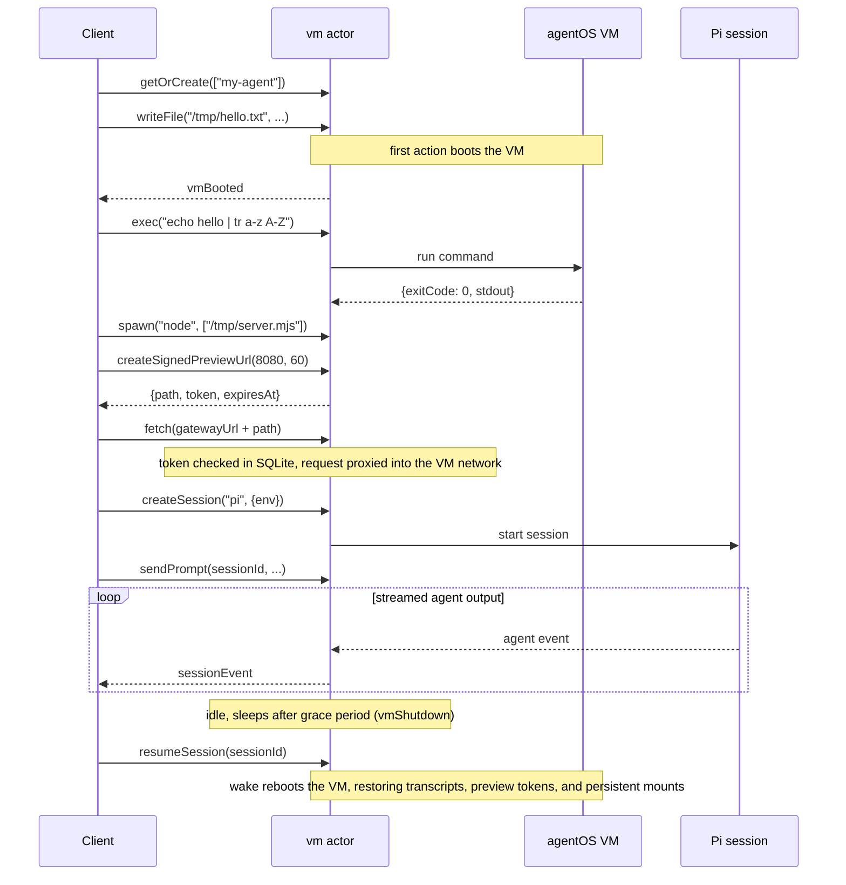

# AI Agent Workspaces

> Source: `src/content/cookbook/ai-agent-workspace.mdx`
> Canonical URL: https://rivet.dev/cookbook/ai-agent-workspace
> Description: Give every AI agent its own computer: a persistent workspace with a filesystem, processes, shells, networking, and agent sessions on a lightweight in-process OS.

---
Patterns for giving every AI agent its own computer with [agentOS](/docs/agent-os): one Rivet Actor per agent that owns a portable, lightweight in-process OS running on Wasm and V8. Use it for code interpreters that keep state between runs, agents that ship artifacts behind shareable preview URLs, per-user dev environments, and scheduled maintenance agents. agentOS is in preview and the API is subject to change.

This entry is about giving an agent a workspace. For conversation memory, message queues, and streaming chat patterns, see [AI Agent](/cookbook/ai-agent/).

## Starter Code

The [agent-os](https://github.com/rivet-dev/rivet/tree/main/examples/agent-os) collection is reference code, one sub-example per capability; treat it as patterns to copy into your project rather than a turnkey app. The [agent-os-e2e](https://github.com/rivet-dev/rivet/tree/main/examples/agent-os-e2e) example is the complete end-to-end walkthrough.

| Example | Starter Code | Use When |
| --- | --- | --- |
| Hello World | [GitHub](https://github.com/rivet-dev/rivet/tree/main/examples/agent-os/src/hello-world) | You want the minimal loop: boot a VM lazily on the first action, write a file, read it back. |
| Filesystem | [GitHub](https://github.com/rivet-dev/rivet/tree/main/examples/agent-os/src/filesystem) | The agent needs the full file surface: recursive listing, stat, move, delete, and custom mounts. |
| Git | [GitHub](https://github.com/rivet-dev/rivet/tree/main/examples/agent-os/src/git) | The agent works with real git repos inside the workspace: init, commit, branch, and clone via `exec`. |
| Processes | [GitHub](https://github.com/rivet-dev/rivet/tree/main/examples/agent-os/src/processes) | The agent runs shell commands with pipes and long-lived spawned programs. |
| Network | [GitHub](https://github.com/rivet-dev/rivet/tree/main/examples/agent-os/src/network) | The agent serves HTTP inside the VM and you need `vmFetch` or signed preview URLs. |
| Cron | [GitHub](https://github.com/rivet-dev/rivet/tree/main/examples/agent-os/src/cron) | The workspace runs scheduled commands or recurring agent work. |
| Tools | [GitHub](https://github.com/rivet-dev/rivet/tree/main/examples/agent-os/src/tools) | You want your backend functions exposed as CLI commands inside the workspace. |
| Agent Session | [GitHub](https://github.com/rivet-dev/rivet/tree/main/examples/agent-os/src/agent-session) | You drive a Pi coding agent session inside the workspace. Requires `ANTHROPIC_API_KEY`. |
| Sandbox Mounting | [GitHub](https://github.com/rivet-dev/rivet/tree/main/examples/agent-os/src/sandbox) | The agent needs native binaries or a real OS, mounted into the VM from a Docker-backed sandbox. Requires Docker. |
| End-to-End Walkthrough | [GitHub](https://github.com/rivet-dev/rivet/tree/main/examples/agent-os-e2e) | You want one runnable script covering files, processes, preview URLs, and a streaming Pi agent session. |

## Setup

The whole backend is one registry with one `agentOs()` actor:

```typescript
import { agentOs } from "rivetkit/agent-os";
import { setup } from "rivetkit";
import common from "@rivet-dev/agent-os-common";
import pi from "@rivet-dev/agent-os-pi";

const vm = agentOs({
  options: { software: [common, pi] },
});

export const registry = setup({ use: { vm } });
registry.start();
```

See the [Quickstart](/docs/agent-os/quickstart) for the client side and project layout.

## Workspace Model

- **One actor per workspace, key as identity.** `client.vm.getOrCreate(["my-agent"])` gives each agent its own workspace; key by user id for per-user dev environments. Each workspace has its own filesystem, processes, and networking with no shared state and no cross-contamination (see the [overview](/docs/agent-os)).
- **Software packages choose what is installed.** agentOS starts with no commands installed. The `software` option installs packages such as `@rivet-dev/agent-os-common` (a meta-package of Wasm command-line tools: coreutils, sed, grep, gawk, findutils, diffutils, tar, and gzip), `@rivet-dev/agent-os-git` (git), and `@rivet-dev/agent-os-pi` (the Pi coding agent). See [Software](/docs/agent-os/software).
- **The VM boots lazily and sleeps when idle.** The first action boots the VM (clients see a `vmBooted` event); when nothing is active, the actor sleeps and broadcasts `vmShutdown`, then wakes on the next action.

What survives a sleep/wake cycle (see [Persistence](/docs/agent-os/persistence)):

| Data | Across sleep/wake |
| --- | --- |
| Session transcripts and event history | Persist in actor SQLite as events stream. `listPersistedSessions` and `getSessionEvents` read them back without booting the VM, and `resumeSession` picks a session back up in a rebooted VM. |
| Signed preview URL tokens | Persist in actor SQLite. Requests are validated against the stored token and the VM reboots lazily to serve them, so preview URLs keep working after sleep. |
| Files | Persist when the mount is backed by a persistent driver (database-backed, S3, or a sandbox mount). In-memory mounts come back empty on wake. |
| Processes, shells, and cron jobs | Do not persist. Restart long-running processes and reschedule cron jobs on wake (recommended extension). |

The actor holds itself awake while sessions, processes, shells, or hooks are active, then sleeps after a grace period.

## Capability Tour

| Area | Use It For | Key Actions | Docs | Example |
| --- | --- | --- | --- | --- |
| Filesystem | Give the agent a file tree to read and write | `readFile`, `writeFile`, `mkdir`, `readdir`, `move` | [Filesystem](/docs/agent-os/filesystem) | [GitHub](https://github.com/rivet-dev/rivet/tree/main/examples/agent-os/src/filesystem) |
| Processes | Run commands and long-lived programs | `exec`, `spawn`, `waitProcess`, `killProcess` | [Processes](/docs/agent-os/processes) | [GitHub](https://github.com/rivet-dev/rivet/tree/main/examples/agent-os/src/processes) |
| Shells | Interactive terminals with streamed output | `openShell`, `writeShell`, `resizeShell`, `closeShell` | [Processes](/docs/agent-os/processes) | No standalone example |
| Networking and preview URLs | Reach services inside the VM and share them externally | `vmFetch`, `createSignedPreviewUrl`, `expireSignedPreviewUrl` | [Networking](/docs/agent-os/networking) | [GitHub](https://github.com/rivet-dev/rivet/tree/main/examples/agent-os/src/network) |
| Cron | Scheduled commands and recurring agent sessions | `scheduleCron`, `listCronJobs`, `cancelCronJob` | [Cron](/docs/agent-os/cron) | [GitHub](https://github.com/rivet-dev/rivet/tree/main/examples/agent-os/src/cron) |
| Agent sessions | Drive a coding agent inside the workspace | `createSession`, `sendPrompt`, `resumeSession`, `closeSession` | [Sessions](/docs/agent-os/sessions) | [GitHub](https://github.com/rivet-dev/rivet/tree/main/examples/agent-os/src/agent-session) |

Two details worth knowing up front:

- `createSignedPreviewUrl` returns a relative path plus the token and expiry. Build the full URL with the client handle's `getGatewayUrl()` method; it is a client method, not an actor action.
- Schedule cron jobs through the actor with the `exec` and `session` action types only. Callback cron actions are defined in server code and do not serialize through `listCronJobs`.

## Driving a Coding Agent Session

Only the Pi agent (`@rivet-dev/agent-os-pi`) is currently supported as a session agent; Amp, Claude Code, Codex, and OpenCode are coming soon. See [Sessions](/docs/agent-os/sessions).

1. `createSession("pi", { env: { ANTHROPIC_API_KEY } })` returns a `sessionId`. The VM does not inherit the host `process.env`, so API keys are passed explicitly per session or kept server-side through the [LLM gateway](/docs/agent-os/llm-gateway).
2. Open a realtime connection and subscribe to `sessionEvent` to stream the agent's output, such as message chunks, as it works.
3. `sendPrompt(sessionId, ...)` starts a turn; `cancelPrompt` stops one in flight.
4. When the agent asks to use a tool, clients receive a `permissionRequest` event and answer with `respondPermission`, or the server auto-approves with the `onPermissionRequest` config hook (see [Permissions](/docs/agent-os/permissions)).
5. Transcripts are persisted automatically in the universal transcript format (Agent Communication Protocol, ACP). After sleep, `resumeSession` continues a session in the rebooted VM, and `listPersistedSessions` plus `getSessionEvents` read history without booting the VM at all.

## Host Tools

Expose your backend functions to the agent as CLI commands inside the workspace. Define a toolkit with `toolKit()` and `hostTool()` (Zod-schema'd JavaScript functions on the host), pass it via `agentOs({ options: { toolKits: [...] } })`, and it is installed as a command such as `agentos-weather forecast --city Paris --days 3` and injected into the agent's system prompt. The agent calls your backend with no HTTP endpoints or MCP servers to stand up, and CLI-shaped tools are code mode compatible for large token savings. See [Tools](/docs/agent-os/tools) and the [tools example](https://github.com/rivet-dev/rivet/tree/main/examples/agent-os/src/tools).

## When to Mount a Full Sandbox

agentOS is not a replacement for sandboxes; it is designed to work alongside them. When a workspace needs native binaries, browsers, compilation, or desktop automation, use sandbox mounting: start a Docker-backed sandbox with `SandboxAgent.start({ sandbox: docker() })`, project its filesystem into the VM as a native directory (for example `/sandbox`) with `createSandboxFs`, and expose sandbox process control as host tools with `createSandboxToolkit`. Filesystem actions like `writeFile` and `readFile` project transparently through the mount while heavy workloads run in the container.

See [Sandbox Mounting](/docs/agent-os/sandbox) for the hybrid model and [agentOS vs Sandboxes](/docs/agent-os/versus-sandbox) for when each side wins: the lightweight VM has a near-zero cold start (~6 ms) and installs with `npm install`, while sandboxes are full Linux environments billed per second of uptime.

## Architecture

| Topic | Summary |
| --- | --- |
| Topology | One `vm[workspaceId]` actor per agent or per user; the actor key is the workspace identity. |
| Ingress | Actor actions for files, processes, networking, cron, and sessions; a realtime connection for streamed events. |
| Streaming | `sessionEvent` per agent event, `processOutput` and `processExit` for spawned processes, `shellData` for interactive shells. |
| Persistence | Session transcripts, event history, and preview tokens in actor SQLite; files persist through persistent mounts. |

**Actors**

- **Key**: `vm[workspaceId]`, for example `client.vm.getOrCreate(["my-agent"])`
- **Responsibility**: Owns one workspace. Boots the VM lazily on the first action, serves all capability actions, proxies signed preview URL requests into the VM's virtual network, and persists sessions and tokens to actor SQLite.
- **Actions** (grouped; the most load-bearing of each area)
  - Filesystem: `readFile`, `writeFile`, `mkdir`, `readdir`, `readdirRecursive`, `stat`, `exists`, `move`, `deleteFile`
  - Processes: `exec`, `spawn`, `writeProcessStdin`, `waitProcess`, `listProcesses`, `killProcess`
  - Shells: `openShell`, `writeShell`, `resizeShell`, `closeShell`
  - Network: `vmFetch`, `createSignedPreviewUrl`, `expireSignedPreviewUrl`
  - Cron: `scheduleCron`, `listCronJobs`, `cancelCronJob`
  - Sessions: `createSession`, `sendPrompt`, `cancelPrompt`, `respondPermission`, `resumeSession`, `closeSession`, `destroySession`, `listPersistedSessions`, `getSessionEvents`
- **Queues**
  - None
- **Events**
  - `vmBooted`
  - `vmShutdown`
  - `sessionEvent`
  - `permissionRequest`
  - `processOutput`
  - `processExit`
  - `shellData`
  - `cronEvent`
- **State**
  - SQLite
  - `agent_os_sessions` and `agent_os_session_events` (session metadata plus seq-ordered transcript events)
  - `agent_os_preview_tokens` (signed preview URL tokens with expiry)
  - `agent_os_fs_entries` (file content for database-backed mounts)

**Lifecycle**



## Security Checklist

- **Authenticate connections**: Add the `onBeforeConnect` hook in the `agentOs()` config so only authorized callers reach a workspace. Signed preview URL requests deliberately skip it because the token is the credential; browsers navigating a preview URL cannot supply actor connection params.
- **Gate agent tool use with permissions**: Session permission requests broadcast as `permissionRequest` events for human-in-the-loop approval via `respondPermission`, or run a server-side `onPermissionRequest` policy for automated pipelines. See [Permissions](/docs/agent-os/permissions).
- **Treat preview URLs as bearer credentials**: Tokens are randomly generated 32-character values with a default expiry of 1 hour and a maximum of 24; revoke early with `expireSignedPreviewUrl`. Preview responses carry permissive CORS headers, so do not serve private data on a preview port without app-level auth.
- **Keep LLM credentials off the browser**: Create sessions from trusted server code with the key in `createSession` env, or keep keys entirely server-side with the [LLM gateway](/docs/agent-os/llm-gateway). Session keys are injected into the session environment inside the VM and are never stored in actor config or SQLite.
- **Treat mounted sandboxes as their own trust boundary**: A mounted sandbox is a full Linux environment outside the workspace's Wasm and V8 isolate. Scope what its network and filesystem can reach before projecting it into an agent's VM.
- **Set resource and cost limits**: Cap per-workspace memory and CPU (`maxMemoryMb`, `maxCpuPercent`, see [Security](/docs/agent-os/security)). Active sessions, processes, and shells hold the actor awake, so add per-workspace session caps and token budgets as a recommended extension.

_Source doc path: /cookbook/ai-agent-workspace_
