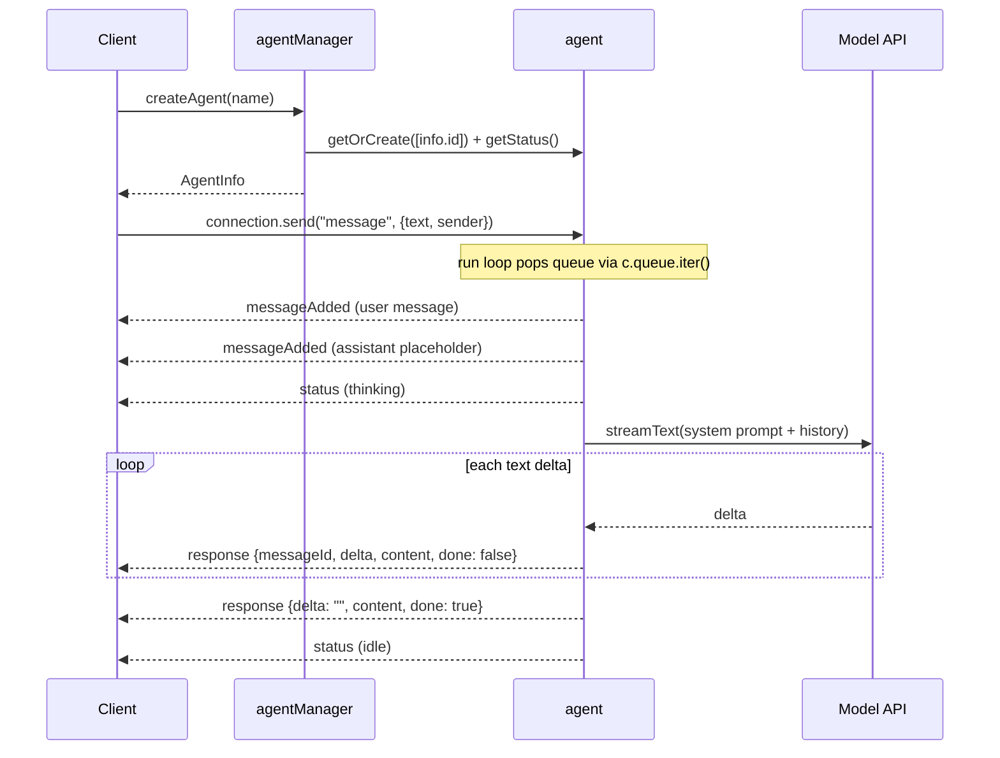

# AI Agent

> Source: `src/content/cookbook/ai-agent.mdx`
> Canonical URL: https://rivet.dev/cookbook/ai-agent
> Description: Build an AI agent backend with persistent memory: one Rivet Actor per conversation, queued message handling, and streaming LLM responses as realtime events.

---
Patterns for building AI agent backends with RivetKit, where each conversation is one Rivet Actor that owns its memory, its message queue, and its streaming output.

## Starter Code

Start with one of the working examples on [GitHub](https://github.com/rivet-dev/rivet/tree/main/examples/ai-agent) and adapt it. The sections below describe the flagship `ai-agent` example unless a variant is called out explicitly.

| Variant | Starter Code | Use When |
| --- | --- | --- |
| Queue-driven AI SDK agent | [GitHub](https://github.com/rivet-dev/rivet/tree/main/examples/ai-agent) | You want a streaming chat agent where each conversation keeps its own persistent memory and processes one message at a time. |
| Sandbox coding agent | [GitHub](https://github.com/rivet-dev/rivet/tree/main/examples/sandbox-coding-agent) | The agent should run a coding agent (Codex by default) inside an isolated [sandbox](/docs/actors/sandbox) via Docker, Daytona, or E2B. |
| Durable streams agent (experimental) | [GitHub](https://github.com/rivet-dev/rivet/tree/main/examples/experimental-durable-streams-ai-agent) | You want replayable, restart-safe prompt and response delivery through durable streams instead of actor state and events. |
| Agent with a workspace (agentOS) | [GitHub](https://github.com/rivet-dev/rivet/tree/main/examples/agent-os) | The agent needs its own persistent computer: a filesystem, processes, shells, and preview URLs. See the cookbook: [AI Agent Workspaces](/cookbook/ai-agent-workspace/). |

## Conversation Memory

Use one actor per conversation, keyed by a conversation or agent id (see [Actor Keys](/docs/actors/keys)). The agent actor's persistent [state](/docs/actors/state) is the conversation memory: in the `ai-agent` example, `messages` and `status` live in JSON actor state and survive sleep and restarts with no external database. Every model call rebuilds the prompt from `c.state.messages` plus a system prompt, so memory and inference input are the same data.

| Variant | Where Memory Lives | Persisted State Fields |
| --- | --- | --- |
| `ai-agent` | JSON actor state | `messages`, `status` |
| `sandbox-coding-agent` | JSON actor state plus the sandbox ACP session | `messages`, `status`, `sessionId` |
| `experimental-durable-streams-ai-agent` | Durable streams; the actor stores only its conversation id and a read cursor | `conversationId`, `promptStreamOffset` |

## Message Handling

In the `ai-agent` example, the client pushes user input onto the agent's `message` [queue](/docs/actors/queues) with `agent.connection.send("message", { text, sender })`. This is a queue push, not an action call. The actor's `run` hook (see [Lifecycle](/docs/actors/lifecycle)) consumes the queue serially with `for await (const queued of c.queue.iter())`.

Serial queue consumption is the per-conversation concurrency guarantee: at most one in-flight model call per actor, with no extra locking. The `status` field (`thinking` while a model call is in flight) is UI signal only; the run loop is the actual lock. The loop also checks `c.aborted` inside the token stream so shutdown exits gracefully.

| Variant | Message Ingress | Serialization Guarantee |
| --- | --- | --- |
| `ai-agent` | `message` queue pushed via `connection.send` | `run` hook pops one queued message at a time with `c.queue.iter()`. |
| `sandbox-coding-agent` | `sendMessage` [action](/docs/actors/actions), no queue | Each call awaits the sandbox round trip before broadcasting the result. |
| `experimental-durable-streams-ai-agent` | Durable prompt stream long-polled from `onWake` | `promptStreamOffset` is persisted per chunk, so restarts resume without reprocessing prompts. |

## Streaming Responses

The `ai-agent` actor broadcasts a `response` [event](/docs/actors/events) for every model text delta. The payload carries `messageId`, the per-token `delta`, the cumulative `content`, and a `done` flag (plus `error` on failure), so clients can either append deltas or idempotently replace the message by `messageId` using `content`. The example frontend replaces by `messageId`, which tolerates dropped events. The terminal broadcast has an empty `delta`, the full `content`, and `done: true`.

Because the assistant message object lives in `c.state.messages` and is mutated in place during streaming, partial content persists if the actor restarts mid-stream. The example broadcasts once per AI SDK delta with no throttling; batching or throttling deltas is a recommended extension for high-traffic deployments, not something the example implements.

Variant differences: `sandbox-coding-agent` sends a single `response` broadcast with `done: true` after the sandbox finishes (no incremental streaming), and `experimental-durable-streams-ai-agent` appends per-token chunks to a durable response stream, then broadcasts `responseComplete` or `responseError`.

## Architecture

| Topic | Summary |
| --- | --- |
| Topology | `agentManager["primary"]` singleton directory plus one `agent[agentId]` actor per conversation. |
| Ingress | Client pushes `AgentQueueMessage` payloads onto the agent's `message` queue with `connection.send`. |
| Streaming | One `response` broadcast per model delta, terminal broadcast with `done: true`. |
| Memory | Full transcript and status in JSON actor state; no external database. |

The manager creates `AgentInfo` records and warms each agent through [actor-to-actor communication](/docs/actors/communicating-between-actors): `createAgent` calls `c.client<typeof registry>()`, then `client.agent.getOrCreate([info.id])` and awaits `getStatus()` so the conversation actor exists before the client connects. The sandbox variant extends this topology with a `codingSandbox` actor that shares the agent's key (`codingSandbox.getOrCreate([c.key[0]])`), so the agent-to-sandbox mapping is implicit in the key space.

**Actors**

- **Key**: `agentManager["primary"]`
- **Responsibility**: Directory actor. Creates `AgentInfo` records, lists agents, and warms each agent actor via `c.client()`.
- **Actions**
  - `createAgent`
  - `listAgents`
- **Queues**
  - None
- **State**
  - JSON
  - `agents`

- **Key**: `agent[agentId]`
- **Responsibility**: One actor per conversation. Holds the full message history and status, consumes queued user messages in its `run` loop, calls the model via the AI SDK, and broadcasts streaming deltas.
- **Actions**
  - `getHistory`
  - `getStatus`
- **Queues**
  - `message`
- **Events**
  - `messageAdded`
  - `status`
  - `response`
- **State**
  - JSON
  - `messages`
  - `status`

**Lifecycle**

## Security Checklist

The examples ship without auth so they stay minimal. Apply this baseline before exposing an agent backend.

- **API keys stay server-side**: `OPENAI_API_KEY` (or `ANTHROPIC_API_KEY`) is read by the AI SDK inside the actor process. The key never reaches the browser; clients only talk to the actor over RivetKit. The sandbox variant forwards keys into the sandbox env, never to the client.
- **Add authentication**: The examples have no auth, so anyone who reaches the server can create agents, list them, and message any agent whose key they can guess. Add `onBeforeConnect` or `createConnState` checks with scoped tokens as a recommended extension. See [Authentication](/docs/actors/authentication).
- **Validate and rate-limit queue payloads**: The example only skips bodies without a string `text`. Enforce payload size limits, schema validation, and per-connection rate limits as a recommended extension.
- **Derive sender identity server-side**: The example trusts the client-supplied `sender` field verbatim. Bind sender identity to the authenticated connection instead.
- **Cap or trim message history**: The example sends the full transcript on every model call with no cap. Trim or summarize old messages as a recommended extension so prompts and state stay bounded.
- **Set cost ceilings per conversation**: Add per-agent token budgets and quotas as a recommended extension. The sandbox variant runs real compute, so also enforce per-user sandbox quotas and restrict sandbox network egress.

_Source doc path: /cookbook/ai-agent_
