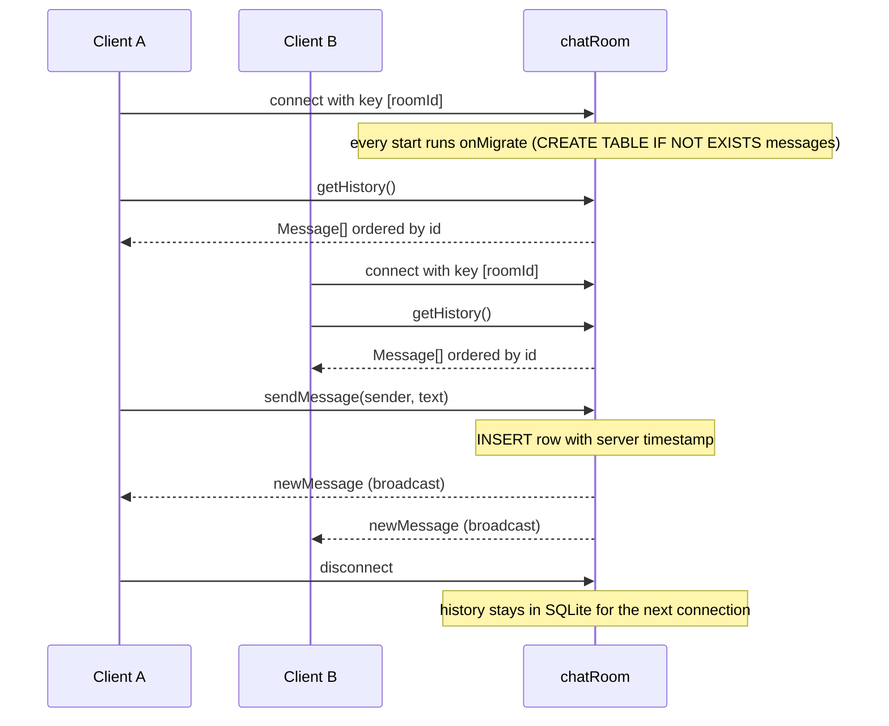

# Chat Room

> Source: `src/content/cookbook/chat-room.mdx`
> Canonical URL: https://rivet.dev/cookbook/chat-room
> Description: Build a realtime chat room backend with Rivet Actors: one actor per room, SQLite-backed message history, and WebSocket broadcast to every connected client.

---
Patterns for building a chat room backend with RivetKit: room-scoped actors, persistent message history, and realtime delivery over WebSocket connections.

## Starter Code

Start with the working example on [GitHub](https://github.com/rivet-dev/rivet/tree/main/examples/chat-room) and adapt it. The backend is a single `chatRoom` actor; the frontend is a React app using `@rivetkit/react` (see the [React quickstart](/docs/actors/quickstart/react)).

| Topic | Summary |
| --- | --- |
| Room model | One `chatRoom` actor per room key. The frontend defaults the key to `general`; typing a different room name connects to a different actor. |
| History | SQLite `messages` table created in `db({ onMigrate })`, read back with `ORDER BY id ASC`. |
| Delivery | `sendMessage` inserts the row, then broadcasts a typed `newMessage` event to every connected client. |
| Identity | None in the example. `sender` is a plain action argument; production should bind identity to the connection. |

## Room-Per-Actor Model

Each room is one Rivet Actor instance, addressed by [key](/docs/actors/keys). The client calls `useActor({ name: "chatRoom", key: [roomId] })`, which gets-or-creates the actor for that room. This gives you:

- **Isolation**: each room's history and connections are fully scoped to its key. Switching the room input re-keys the hook and connects to a different actor with separate history.
- **A single serialized writer**: all `sendMessage` calls for one room run through one actor, so message ordering is consistent without locks. The SQLite `AUTOINCREMENT` id is the canonical order, which is why `getHistory` sorts by `id` rather than by timestamp.
- **Natural scaling**: rooms spread across the cluster independently. A hot room does not slow down other rooms.

## Message History Storage

This example stores history in the actor's SQLite database, not in JSON state. Pick based on history size and query needs:

| Approach | Use When | Implementation Guidance |
| --- | --- | --- |
| [SQLite](/docs/actors/sqlite) (what this example uses) | Large or long-lived history that needs ordering, caps, pagination, or search | Create the `messages` table in `db({ onMigrate })`, insert with parameterized queries (`c.db.execute("INSERT ... VALUES (?, ?, ?)", ...)`), and read with `ORDER BY id ASC`. History survives actor sleep and scales past what you want in memory. |
| [JSON state](/docs/actors/state) | Small recent history, for example the last 50 to 100 messages | Push onto a `messages` array in actor state and trim to a cap on every send. Simplest option, but the whole history lives in memory and there is no query layer, so it only fits bounded recent-history use cases. |

## Broadcast Delivery

New messages reach connected clients through a typed [event](/docs/actors/events):

- The actor declares `events: { newMessage: event() }`, where `Message` is `{ sender, text, timestamp }`.
- The `sendMessage` [action](/docs/actors/actions) builds the message with a server-side `Date.now()` timestamp, inserts it into the `messages` table, then calls `c.broadcast("newMessage", message)` and returns the message to the caller.
- Each client subscribes with `useEvent("newMessage", ...)` and appends to its local list. The sender renders its own message through the same broadcast path as everyone else, so all clients stay on one code path.
- History load is connection-gated: once the connection is ready, the client calls `getHistory()` once to render the backlog, then relies on events for everything after.

Use `c.broadcast(...)` for room-wide messages. For private or per-recipient payloads (such as DMs inside a room), send on the individual connection instead, which is a recommended extension beyond this example.

## Typing Indicators And Presence (Extension)

The example does not implement typing indicators, presence, or join/leave handling of any kind. There is no `createConnState`, `onConnect`, or `onDisconnect` in the code. If you need them, add them as ephemeral [connection](/docs/actors/connections) behavior:

- **Keep it ephemeral**: store the username and typing flag in per-connection state, never in SQLite or persisted actor state. Presence is derived from live connections and should disappear with them.
- **Broadcast on change only**: emit a typing event when a user starts or stops typing, and a presence event from `onConnect` / `onDisconnect`, rather than polling or ticking.
- **Expire on the client**: clear a typing indicator after a short client-side timeout so a dropped connection never leaves a stuck "is typing" row.

## Per-User Inbox (Extension)

For offline delivery, DMs, unread counts, or notification fanout, add a `userInbox[userId]` actor per user. This is an extension beyond the example:

- The room actor forwards each message to the inbox actor of every member via [actor-to-actor calls](/docs/actors/communicating-between-actors), so users who are not connected to the room still accumulate messages.
- The inbox actor owns per-user unread state and serves it when the user comes online, independent of which rooms they are in.
- DMs become a degenerate room: either a `chatRoom` keyed by the sorted pair of user ids, or direct inbox-to-inbox delivery if you do not need shared history semantics.

## Actors

- **Key**: `chatRoom[roomId]`
- **Responsibility**: Owns one chat room. Persists the room's message history in its SQLite database and broadcasts each new message to every connected client.
- **Actions**
  - `sendMessage`
  - `getHistory`
- **Queues**
  - None
- **Events**
  - `newMessage`
- **State**
  - SQLite
  - `messages` table: `id` (autoincrement primary key), `sender`, `text`, `timestamp`

## Lifecycle

## Security Checklist

The example is intentionally minimal and skips all of the following. Add them before production:

- **Auth before join**: any client can join any room by knowing its name, and `sender` is arbitrary client input on every call. Validate a token during [connection auth](/docs/actors/authentication), bind identity to [connection state](/docs/actors/connections), and check room membership before serving history. Never trust a sender name passed as an action argument.
- **Message length clamps**: the example accepts empty messages and has no length limit. Trim server-side, reject empty text, and clamp to a maximum length.
- **Per-connection rate limiting**: rate limit `sendMessage` per connection to stop spam and broadcast amplification.
- **Server-side timestamps and ids**: the example already does this correctly. `timestamp` comes from `Date.now()` inside the action and `id` from SQLite `AUTOINCREMENT`. Keep it that way; never accept client-supplied timestamps or ids.
- **History caps**: `getHistory` returns every row with no limit. Add a `LIMIT` plus pagination, and prune or archive old rows so a long-lived room cannot grow unbounded.
- **Parameterized queries**: the example already inserts with `?` placeholders. Keep all user-supplied text out of SQL string interpolation.

_Source doc path: /cookbook/chat-room_
