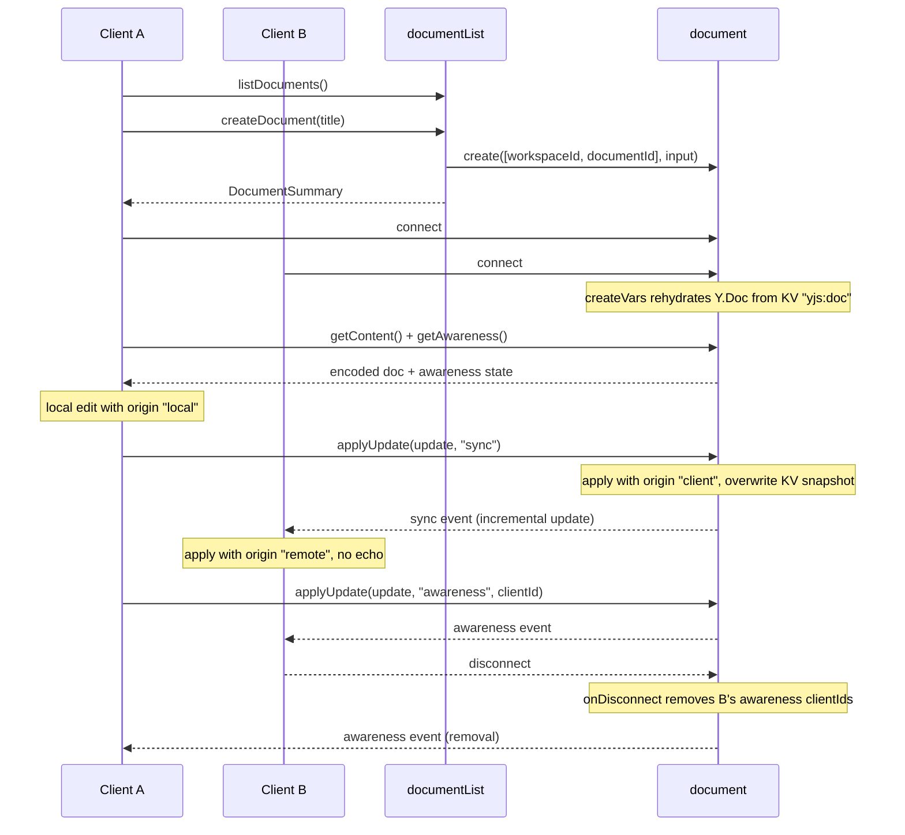

# Collaborative Text Editor

> Source: `src/content/cookbook/collaborative-text-editor.mdx`
> Canonical URL: https://rivet.dev/cookbook/collaborative-text-editor
> Description: Build a collaborative text editor backend with Yjs CRDTs and Rivet Actors: per-document actors relay sync and awareness updates and persist snapshots.

---
Patterns for building a Yjs server on RivetKit: CRDT document sync, presence and cursors, and snapshot persistence, with one Rivet Actor per document acting as a relay.

## Starter Code

Start with the working example on [GitHub](https://github.com/rivet-dev/rivet/tree/main/examples/collaborative-document) and adapt it to your editor. It ships a React frontend with a plain textarea, remote cursor overlays, and a workspace document index.

| Use Case | Starter Code | Common Examples |
| --- | --- | --- |
| Shared document editing | [GitHub](https://github.com/rivet-dev/rivet/tree/main/examples/collaborative-document) | Notion-style docs, shared notes, pair-writing tools, form co-editing |

## CRDT vs OT

Two families of algorithms solve concurrent text editing. The choice decides what your server has to do.

| Dimension | CRDT (Yjs) | Operational Transformation |
| --- | --- | --- |
| Conflict resolution model | Commutative merges. Updates apply in any order on any peer and converge to the same result. | Server transforms each operation against every concurrent operation. Correctness depends on a central sequencer. |
| Offline support | Strong. Clients keep editing locally and merge buffered updates on reconnect. | Weak. Long-lived divergence makes transformation chains complex and fragile. |
| Server role | Relay plus persistence. The server applies opaque updates and rebroadcasts them. It never needs to understand document semantics. | Authoritative transformer. The server must implement transformation logic for every operation type. |
| Library maturity | Yjs is mature and widely deployed, with bindings for ProseMirror, CodeMirror, Monaco, and others. | Production-grade implementations are mostly proprietary (Google Docs) or aging (ShareDB). |

The example uses Yjs because CRDTs let the server stay a relay-style Rivet Actor. The actor applies each incoming update to a server-side `Y.Doc` so it can persist the merged state and serve late joiners, but it never transforms operations or arbitrates conflicts. Ordering does not matter because Yjs merges are commutative.

## Document Actor Model

| Topic | Summary |
| --- | --- |
| Topology | One `document[workspaceId, documentId]` actor per document plus one `documentList[workspaceId]` coordinator per workspace. |
| Sync model | Each client holds a local `Y.Doc`. The document actor relays incremental Yjs updates as broadcast [events](/docs/actors/events) and keeps a server-side merged copy in vars. |
| Persistence | Full merged Yjs snapshot overwritten in one binary [actor KV](/docs/actors/kv) key (`yjs:doc`) on every sync update. Document metadata lives in JSON [state](/docs/actors/state). |
| Queues | None. The example is purely [actions](/docs/actors/actions) plus broadcast events. |
| Presence | Yjs Awareness relayed through the same `applyUpdate` action. Per-connection `connState` tracks asserted awareness clientIds for disconnect cleanup. |

The two-actor split follows the coordinator pattern from [Design Patterns](/docs/actors/design-patterns): the coordinator owns discovery and creation, and each document actor owns one document's realtime state. Multi-part [keys](/docs/actors/keys) scope both actors to a workspace.

**Actors**

- **Key**: `document[workspaceId, documentId]`
- **Responsibility**: Applies incoming sync and awareness updates to a server-side `Y.Doc` and `Awareness`, persists the merged Yjs snapshot to actor KV, and broadcasts updates to all connected collaborators.
- **Actions**
  - `getContent`
  - `applyUpdate`
  - `getAwareness`
- **Queues**
  - None
- **State**
  - JSON metadata only: `title`, `createdAt`, `updatedAt`
  - Binary KV key `yjs:doc` holding the full merged Yjs snapshot
  - Ephemeral vars: the live `Y.Doc` and `Awareness`, created in `createVars` and rehydrated from KV on actor start
  - Per-connection `connState`: `clientIds` of awareness clients asserted by that connection

- **Key**: `documentList[workspaceId]`
- **Responsibility**: Coordinator for one workspace. Creates document actors through the actor-to-actor client and maintains the index of document summaries.
- **Actions**
  - `createDocument`
  - `listDocuments`
  - `deleteDocument`
- **Queues**
  - None
- **State**
  - JSON
  - `documents` array of `DocumentSummary` entries (`id`, `title`, `createdAt`, `updatedAt`)

The coordinator's `createDocument` generates a UUID, then explicitly creates the document actor with `c.client<typeof registry>()` and passes `{ title, createdAt }` as creation [input](/docs/actors/input), which the document actor's `createState` consumes. See [Communicating Between Actors](/docs/actors/communicating-between-actors) for the actor-to-actor client.

## Update Relay

A single `applyUpdate(update, kind, clientId?)` action handles both update kinds. Updates cross the action boundary as `number[]` byte arrays and are converted back to `Uint8Array` on each side.

| Kind | Server Applies To | Persists | Broadcasts |
| --- | --- | --- | --- |
| `"sync"` | `c.vars.doc` via `Y.applyUpdate` with origin `"client"` | Full merged snapshot to KV key `yjs:doc`, then bumps `updatedAt` | `sync` event carrying the incremental update |
| `"awareness"` | `c.vars.awareness` via `applyAwarenessUpdate` with origin `"client"` | Nothing. Presence is ephemeral. | `awareness` event carrying the update |

Note the asymmetry on the sync branch: the broadcast carries only the small incremental update, while the KV write stores the full merged document re-encoded with `Y.encodeStateAsUpdate`.

Yjs origin tags are the echo guards that keep the relay loop-free:

| Origin Tag | Set Where | Effect |
| --- | --- | --- |
| `"local"` | Client edits inside `doc.transact(..., "local")` | The client's update listener fires and sends `applyUpdate` to the actor. |
| `"client"` | Server applying an incoming update to its `Y.Doc` or `Awareness` | Marks the change as client-originated on the server copy. |
| `"remote"` | Client applying broadcast events or initial sync data | Update listeners early-return on `"remote"`, so a client never re-sends its own echo. |

On connect or reconnect, the client calls `getContent` and `getAwareness`, then applies both results to its local `Y.Doc` and `Awareness` with origin `"remote"`. After that, every change flows through `applyUpdate` and the broadcast events.

## Awareness And Presence

Presence (user names, colors, cursor positions) rides on the Yjs Awareness protocol instead of actor state:

- Clients set presence with `awareness.setLocalStateField` for the `user` and `cursor` fields. The awareness update listener encodes the change and sends `applyUpdate(update, "awareness", awareness.clientID)`.
- The actor records each asserted `clientId` in that connection's `connState.clientIds`, applies the update to the server-side `Awareness`, and broadcasts the `awareness` event to all peers. See [Connections](/docs/actors/connections) for per-connection state.
- `onDisconnect` reads the connection's `clientIds`, calls `removeAwarenessStates` on the server-side `Awareness`, and broadcasts the encoded removal so every remaining client drops the departed user's cursor. See [Lifecycle](/docs/actors/lifecycle) for the hook.

Because the actor tracks which awareness clientIds belong to which connection, presence cleanup is automatic on disconnect with no client cooperation required.

## Persistence And Compaction

The example persists with a full-snapshot overwrite: on every `"sync"` update, the actor re-encodes the entire merged document with `Y.encodeStateAsUpdate` and overwrites the single binary KV key `yjs:doc`. There is no append-only update log and no separate compaction job. Compaction is implicit because `Y.encodeStateAsUpdate` emits one compact merged representation of the document, so Yjs merge semantics keep the stored blob compact on their own.

| Property | Full-Snapshot Overwrite (the example) |
| --- | --- |
| Write cost | One full-document KV write per sync update, so every keystroke rewrites the whole blob. |
| Read cost | One binary KV read in `createVars` rehydrates the document on actor start. |
| Crash safety | The last completed `applyUpdate` is durable. No log replay needed. |
| Sweet spot | Small to medium documents where simplicity beats write amplification. |

**Recommended extension (not in the example)**: for large documents or very high edit rates, switch to appending incremental updates to a KV update log and writing a merged snapshot only periodically (for example every N updates). Boot becomes snapshot plus log replay, and the snapshot write becomes the explicit compaction step that truncates the log. Adopt this only when full-snapshot writes become the measured bottleneck or the blob approaches KV value size limits.

## Lifecycle

## Security Checklist

The example ships with no authentication or authorization. Harden it with this baseline before production. None of these are implemented in the example.

- **Authenticate before connect**: Anyone who knows or guesses a workspace ID can connect, and because `useActor` implicitly getOrCreates, connecting with a nonexistent workspace ID silently creates a blank `documentList` coordinator. Add connection auth so unauthenticated clients never reach an actor. See [Authentication](/docs/actors/authentication).
- **Per-document access control**: Validate that the authenticated user is allowed to access the specific `[workspaceId, documentId]` key, not just any document.
- **Cap and rate limit `applyUpdate`**: Update payloads are unvalidated `number[]` arrays with no size limit, and the example client sends one action per keystroke and per cursor move with zero throttling. Enforce payload size caps and per-connection rate limits on the server, and debounce on the client.
- **Do not trust client-asserted awareness clientIds**: The `clientId` argument to `applyUpdate` is client-supplied and trusted as-is. Derive or verify presence identity from connection-scoped server state instead.
- **Destroy actors and KV on delete**: `deleteDocument` only filters the entry out of the coordinator's index. The document actor and its KV snapshot are orphaned. On delete, also destroy the document actor and its storage, with a permission check on who may delete.

_Source doc path: /cookbook/collaborative-text-editor_
