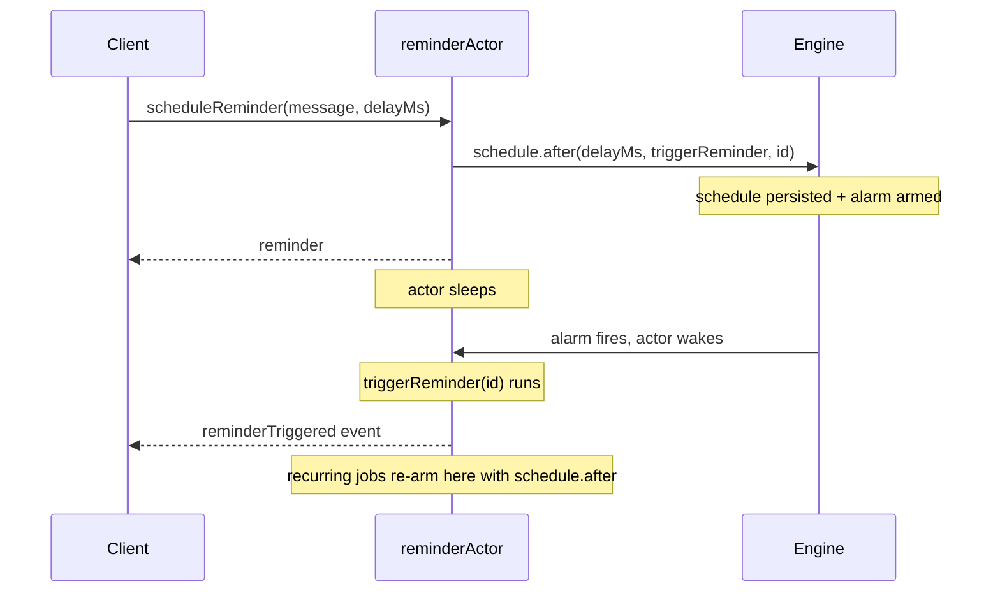

# Cron Jobs and Scheduled Tasks

> Source: `src/content/cookbook/cron-jobs.mdx`
> Canonical URL: https://rivet.dev/cookbook/cron-jobs
> Description: Durable cron jobs with Rivet Actors: schedule.after and schedule.at timers survive restarts and crashes, plus re-arming recurring jobs and idempotent handlers.

---
Patterns for running durable cron jobs and scheduled tasks on Rivet Actors. Actor schedules are persistent timers owned by the engine, so a job keeps its deadline through actor sleep, restarts, upgrades, deploys, and crashes.

## Starter Code

Start from the working [Scheduling example on GitHub](https://github.com/rivet-dev/rivet/tree/main/examples/scheduling). It implements a reminder service with one-shot timers, a React frontend, and live trigger events.

## The Scheduling API

The full API is documented in [Scheduling](/docs/actors/schedule). There are two methods, both available on the actor context:

| Method | Behavior |
| --- | --- |
| `c.schedule.after(duration, actionName, ...args)` | Runs the named action after `duration` milliseconds. |
| `c.schedule.at(timestamp, actionName, ...args)` | Runs the named action at an exact epoch timestamp in milliseconds. |

Key properties:

- **Durable**: The schedule is persisted by the engine and the timer survives actor sleep, restart, upgrade, and crash. If the actor is asleep at the deadline, the engine wakes it to run the action. See [Lifecycle](/docs/actors/lifecycle).
- **Plain actions as callbacks**: The scheduled callback is an ordinary [action](/docs/actors/actions) on the same actor, invoked by name. Arguments after the action name are forwarded positionally, for example `c.schedule.after(delayMs, "triggerReminder", reminder.id)`.
- **No cancellation API**: Rivet does not currently support canceling a scheduled action. The pattern is a tombstone guard: remove the entry from [state](/docs/actors/state) and have the scheduled action no-op when it cannot find its entry. The example's `cancelReminder` and `triggerReminder` actions implement exactly this.

## Recurring Jobs Via Re-Arm

`c.schedule` is one-shot, so recurring jobs are built by having the scheduled action re-arm itself at the end of each run:

```typescript
import { actor } from "rivetkit";

const DAY_MS = 24 * 60 * 60 * 1000;

export const dailyReport = actor({
  state: { lastRunAt: 0 },
  actions: {
    runReport: (c) => {
      // Do the job's work, then record the run.
      c.state.lastRunAt = Date.now();
      // Re-arm the next run before returning.
      c.schedule.after(DAY_MS, "runReport");
    },
  },
});
```

Arm the first run from `onCreate` or a setup action; after that, the action keeps the chain alive by rescheduling itself.

Re-arming with `after` measures the next run from the end of the current one, so the cadence drifts later by the job's runtime on every cycle. If runs must stay aligned to a fixed cadence, re-arm with `c.schedule.at(c.state.lastRunAt + DAY_MS, "runReport")` instead.

The Scheduling example itself only uses one-shot reminders. A real re-arm implementation lives in the [idle world actor](https://github.com/rivet-dev/rivet/tree/main/examples/multiplayer-game-patterns/src/actors/idle/), where the `collectProduction` action credits production, updates `lastCollectedAt`, and calls a `scheduleCollection` helper that re-arms with `c.schedule.after(delayMs, "collectProduction", { buildingId })`. It also shows catch-up handling: if the action runs late, it computes how many whole intervals elapsed since the last run and credits them in one batch before re-arming.

For multi-step jobs that need retries and progress tracking inside a single run, consider [Workflows](/docs/actors/workflows) instead of chaining schedules.

## Durability Comparison

| Approach | Timer Durability | Horizontal Scaling | Deploys And Restarts |
| --- | --- | --- | --- |
| `setTimeout` / `setInterval` | In-process memory only | Every replica arms its own timer, so jobs run once per instance | All pending timers are lost on restart or crash |
| `node-cron` and similar libraries | In-process memory only | Every instance runs the job unless you add external locking | Schedule resets on deploy; runs missed during downtime are skipped |
| External cron service | Lives outside your app | Needs a public HTTP endpoint plus its own dedupe and retry state | Survives your deploys but is separate infrastructure to operate |
| Rivet Actor scheduling | Persisted by the engine as a durable timer | Exactly one actor per key, so the timer is armed once rather than once per replica | Survives actor sleep, restart, upgrade, and crash |

## Idempotency

A scheduled action can fire more than you expect: a crash between doing the work and re-arming can cause the action to run again, and because schedules cannot be cancelled, an action can fire for an entry that was already removed. Design handlers so a duplicate firing is harmless:

- **Store a run marker in state**: Keep a `lastRunAt` timestamp or a sequence number in actor state and update it inside the action. On each firing, compute elapsed time since the marker and skip or batch accordingly. The idle world actor's `collectProduction` does this with `lastCollectedAt` and whole-interval batching.
- **Tombstone guard for cancelled entries**: The example's `triggerReminder` looks the reminder up in `c.state.reminders` first and returns with a warning if it is gone, so a fire-after-cancel is a safe no-op.
- **Keep work and marker updates in the same action**: Actor state writes are persisted with the action, so updating the marker in the same handler that does the work keeps the two consistent.

## Topology

| Topology | Use When | Example Key |
| --- | --- | --- |
| Singleton job actor | One global job such as a nightly report or cleanup pass | `job["daily-report"]` |
| Actor per scheduled entity | Per-user or per-resource timers such as reminders, trials, or billing periods | `reminder[userId]` |

The Scheduling example uses a single shared `reminderActor["main"]` key for demo simplicity. For production reminder systems, prefer one actor per user so timers, state, and load are isolated per entity. See [Keys](/docs/actors/keys).

## Reminder Service Example

| Topic | Summary |
| --- | --- |
| Scheduling | One-shot timers armed with `c.schedule.after(delayMs, "triggerReminder", reminder.id)` or `c.schedule.at(timestamp, "triggerReminder", reminder.id)`. |
| State | JSON state holding `reminders` and `completedCount`; the scheduled action mutates state when it fires. |
| Events | `triggerReminder` broadcasts a `reminderTriggered` event to all connected clients. See [Events](/docs/actors/events). |
| Cancellation | `cancelReminder` only removes the reminder from state; the scheduled action may still fire and no-ops via a state lookup guard. |

**Actors**

- **Key**: `reminderActor["main"]`
- **Responsibility**: Stores reminders in persistent state, arms a future self-action per reminder via `c.schedule`, marks reminders completed when the scheduled action fires, and broadcasts `reminderTriggered` to connected clients.
- **Actions**
  - `scheduleReminder`
  - `scheduleReminderAt`
  - `triggerReminder`
  - `getReminders`
  - `cancelReminder`
  - `getStats`
- **Queues**
  - None
- **State**
  - JSON
  - `reminders`
  - `completedCount`

**Lifecycle**



## Security Checklist

The example is intentionally open: any client can connect to the shared `["main"]` key and schedule or cancel anything. Treat all of the following as required extensions for production:

- **Validate schedule inputs**: Clamp `delayMs` and `timestamp` from clients. Reject negative delays, timestamps in the past, and absurdly far-future deadlines, and bound message or payload sizes.
- **Never schedule client-chosen actions**: Expose specific actions like `scheduleReminder` that internally arm a fixed callback. Do not pass a client-supplied action name or unchecked args into `c.schedule`.
- **Authenticate and scope keys**: Add connection [authentication](/docs/actors/authentication) and use per-user actor keys instead of one global key, so users cannot read or cancel each other's schedules.
- **Prune completed entries**: The example's `reminders` array grows without bound. Remove or archive completed entries so state stays small.
- **Use stable IDs**: Generate entry IDs with `crypto.randomUUID()` rather than timestamp-plus-random strings.

_Source doc path: /cookbook/cron-jobs_
