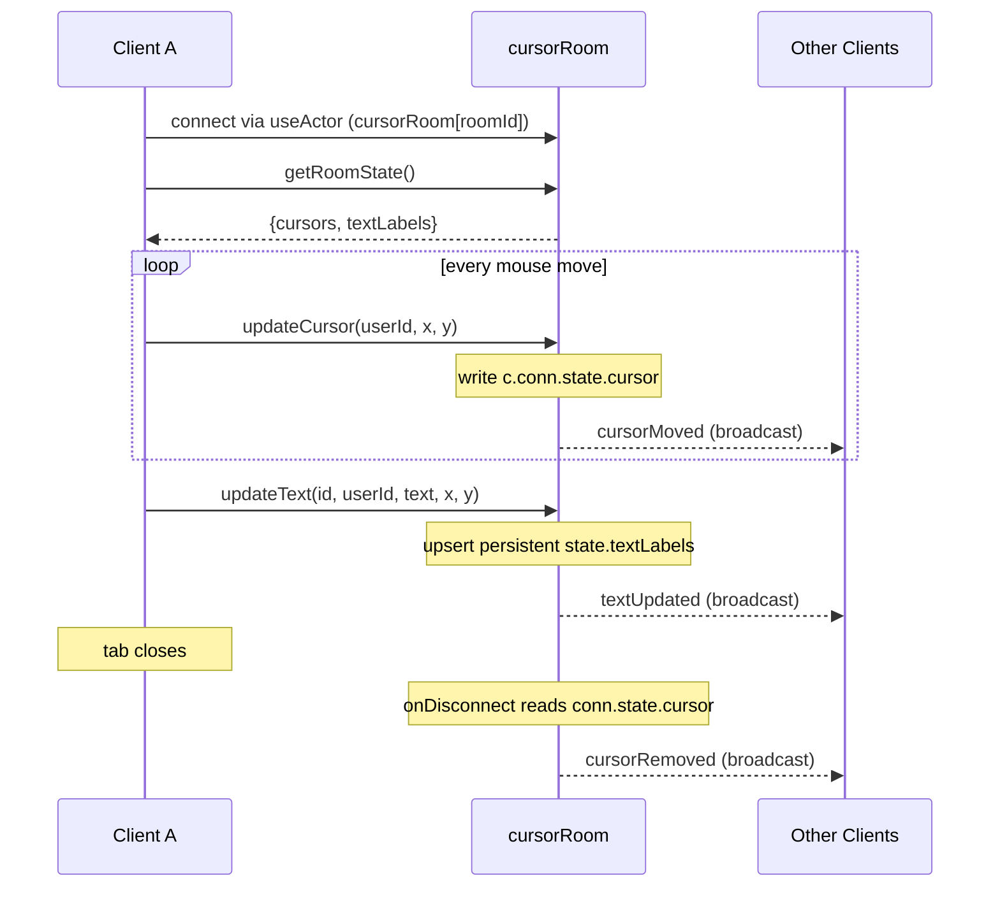
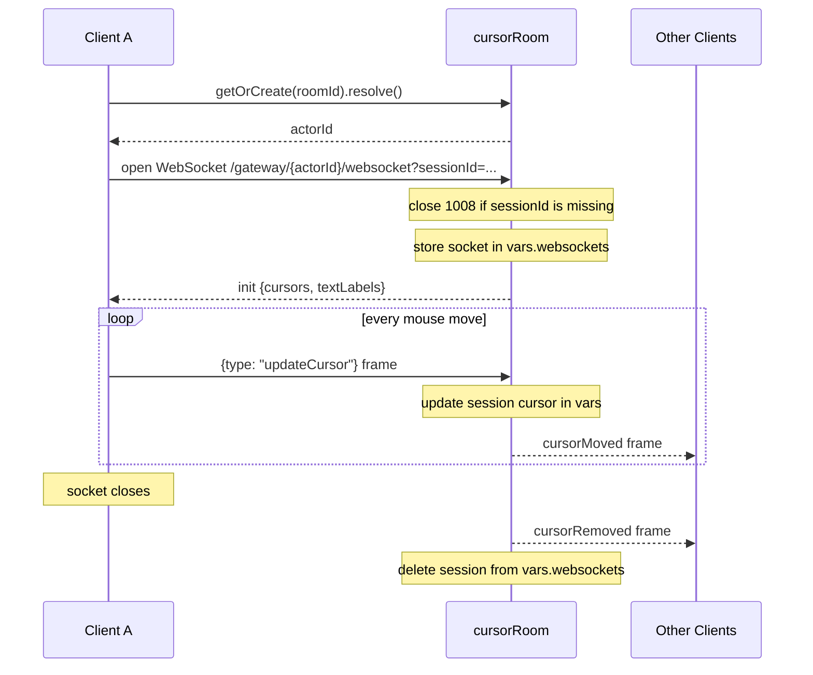

# Live Cursors and Presence

> Source: `src/content/cookbook/live-cursors.mdx`
> Canonical URL: https://rivet.dev/cookbook/live-cursors
> Description: Live cursors and multiplayer presence with Rivet Actors: per-connection cursor state, realtime updates over events or raw WebSockets, and throttling.

---
Patterns for building live cursors, multiplayer presence, and realtime cursor sharing with RivetKit. One room actor fans cursor positions out to every connected client, keyed per room with [actor keys](/docs/actors/keys).

## Starter Code

Start with one of the two working variants on GitHub. Both implement the same collaborative cursor canvas with persistent text labels; they differ only in transport.

| Variant | Starter Code | Transport | Presence Storage |
| --- | --- | --- | --- |
| `cursors` | [GitHub](https://github.com/rivet-dev/rivet/tree/main/examples/cursors) | Typed [actions](/docs/actors/actions) and [events](/docs/actors/events) over the RivetKit connection | `connState` per connection |
| `cursors-raw-websocket` | [GitHub](https://github.com/rivet-dev/rivet/tree/main/examples/cursors-raw-websocket) | Raw [`onWebSocket` handler](/docs/actors/websocket-handler) with a custom JSON message protocol | Socket map in `createVars` |

Use `cursors` by default: typed actions, typed events, and automatic connection tracking cover most apps with less code. Use `cursors-raw-websocket` when you need full control of the wire format, for example a custom JSON or binary protocol, or clients that do not use the RivetKit client library.

## Connection State vs Persistent State

Presence is ephemeral by definition. A cursor position is only meaningful while its connection is alive, so it belongs in per-connection storage, not in persistent actor state. Persistent state is reserved for data that must survive disconnects and actor restarts.

| Data | Where It Lives | Why |
| --- | --- | --- |
| Cursor position | `connState` (`cursors`) or the `createVars` socket map (`cursors-raw-websocket`) | Scoped to one connection and discarded with it. Stale presence cannot accumulate in storage. |
| Text labels (`textLabels`) | Persistent actor `state` in both variants | Canvas content must survive disconnects and actor restarts. |

In the `cursors` variant, `updateCursor` writes `c.conn.state.cursor` and `getRoomState` rebuilds the presence snapshot by iterating `c.conns.values()`, so the cursor map is always derived from live connections rather than stored. See [Connections](/docs/actors/connections) for `connState` and [State](/docs/actors/state) for persistence semantics.

## Presence Lifecycle

- **Join**: The `cursors-raw-websocket` variant pushes an `init` message with the current `{ cursors, textLabels }` snapshot as soon as a socket connects. The `cursors` variant has no explicit join broadcast; the client calls the `getRoomState` action once after connecting to seed its local maps, and peers first see a new user on that user's first `cursorMoved` broadcast.
- **Move**: Every `updateCursor` call writes the connection's presence entry, then broadcasts `cursorMoved` to all connections, including the sender.
- **Leave**: The `cursors` variant handles leave in `onDisconnect`, broadcasting `cursorRemoved` with the connection's last cursor. The raw variant does the same from the socket `close` listener, then deletes the session from the `vars.websockets` map. Clients delete that user from their local cursor map, so stale cursors disappear the moment a tab closes.

See [Lifecycle](/docs/actors/lifecycle) for `onDisconnect` and `createVars`.

## Update Throttling

Neither example throttles. Both frontends send a cursor update on every raw `mousemove` event with no debounce or interval cap. That is fine for a demo, but a fast mouse on a high-refresh display can emit hundreds of events per second per user. The patterns below are recommended production hardening on top of the starter code, not something the examples implement.

| Layer | Pattern | Guidance |
| --- | --- | --- |
| Client (smoothness) | Throttle to 20-30Hz | Sample the latest pointer position every 33-50ms and send only that. Drop intermediate moves, but always flush the final position so cursors settle at the true location. Interpolate between received positions on the rendering side. |
| Server (enforcement) | Per-connection rate limit | Track the last accepted update timestamp per connection and drop or coalesce updates arriving faster than your cap. Client throttles are cooperative; the actor is the enforcement boundary. |

## Actors

- **Key**: `cursorRoom[roomId]` (the frontend defaults `roomId` to `"general"`)
- **Responsibility**: Holds per-connection cursor presence in `connState`, persists shared text labels in actor state, and broadcasts cursor and text updates to all connections.
- **Actions**
  - `updateCursor`
  - `updateText`
  - `removeText`
  - `getRoomState`
- **Events**
  - `cursorMoved`
  - `cursorRemoved`
  - `textUpdated`
  - `textRemoved`
- **Queues**
  - None
- **State**
  - JSON
  - `textLabels` (persistent)
  - `connState.cursor` per connection (ephemeral)

- **Key**: `cursorRoom[roomId]` (resolved via `client.cursorRoom.getOrCreate(roomId)`)
- **Responsibility**: Exposes a raw WebSocket endpoint, tracks live sockets and their cursors in a `createVars` map keyed by a `sessionId` query parameter, persists text labels, and manually fans JSON frames out to every socket.
- **Actions**
  - `getOrCreate` (stub returning `{ status: "ok" }`; the frontend resolves the actor ID with the client handle's `getOrCreate(roomId).resolve()`, which creates the actor without dispatching this action)
  - `getRoomState`
- **Queues**
  - None
- **State**
  - JSON
  - `textLabels` (persistent)
  - `vars.websockets` map of `sessionId` to socket and cursor (in-memory, lost on restart)

The raw variant defines no RivetKit events. Its message names are `type` fields on raw JSON frames:

| Direction | Message `type` | Payload |
| --- | --- | --- |
| Client to server | `updateCursor` | `{ userId, x, y }` |
| Client to server | `updateText` | `{ id, userId, text, x, y }` |
| Client to server | `removeText` | `{ id }` |
| Server to client | `init` | `{ cursors, textLabels }` snapshot on connect |
| Server to client | `cursorMoved`, `textUpdated`, `textRemoved`, `cursorRemoved` | The corresponding cursor, label, or ID payload |

## Lifecycle

### cursors (Actions + Events)

### cursors-raw-websocket

## Security Checklist

Both examples ship without authentication so the presence pattern stays readable. Everything below is recommended hardening for production, not behavior the examples implement.

- **Identity**: Bind presence identity to the connection (`c.conn.id` in the actions variant, a server-generated session ID in the raw variant). Never trust a client-supplied `userId`; in the examples it is a random client-generated string, so any client can impersonate or remove any cursor.
- **Authorization**: Authorize label mutations by owner. In the examples, `updateText` accepts arbitrary `id` and `userId` arguments and `removeText` accepts an arbitrary `id`, so any client can edit or delete any label.
- **Input validation**: Clamp `x` and `y` to canvas bounds, cap text label length, and cap the total `textLabels` count so persistent state cannot grow unbounded.
- **Rate limiting**: Enforce a per-connection cap on `updateCursor` (for example 30Hz) and on label writes, as described in [Update Throttling](#update-throttling).
- **Protocol strictness (raw variant)**: Validate message shape before use and close the socket on malformed JSON instead of logging and continuing. Reject duplicate `sessionId` values rather than silently overwriting another session's socket entry.

_Source doc path: /cookbook/live-cursors_
