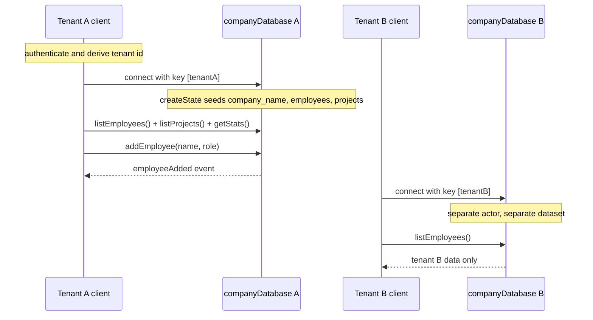

# Database per Tenant

> Source: `src/content/cookbook/per-tenant-database.mdx`
> Canonical URL: https://rivet.dev/cookbook/per-tenant-database
> Description: Multi-tenant data isolation with one Rivet Actor per tenant: the actor key is the tenant id, so each tenant gets its own isolated dataset and migrations.

---
Patterns for database-per-tenant architectures with RivetKit. Instead of one shared database with a `tenant_id` column on every table, each tenant gets its own Rivet Actor, and that actor owns the tenant's entire dataset.

## Starter Code

Start with the working example on [GitHub](https://github.com/rivet-dev/rivet/tree/main/examples/per-tenant-database) and adapt it. The example stores each tenant's dataset in JSON actor state and serves a React dashboard with live event updates.

| Topic | Summary |
| --- | --- |
| Isolation | One `companyDatabase` actor per tenant, keyed by company name. Switching tenants swaps the entire dataset. |
| State | JSON actor state holding `employees` and `projects` arrays plus timestamps. No SQLite, no queues, no scheduling. |
| Realtime | Every write action mutates state, then broadcasts a typed event (`employeeAdded`, `projectAdded`) to all connected clients of that tenant. |
| Auth | None. The sign-in screen is cosmetic. Production guidance is in the [security checklist](#security-checklist). |

## The Isolation Model

The actor key is the tenant id. The client connects with `useActor({ name: "companyDatabase", key: [companyName] })` and the actor reads `c.key[0]` in `createState` to seed that tenant's dataset. This gives you:

- **One actor per tenant**: `companyDatabase[tenantId]` addresses exactly one actor instance. Two tenants can never share an actor.
- **One dataset per tenant**: All reads and writes go through that actor's [state](/docs/actors/state), so there is no shared table with a `tenant_id` column to filter incorrectly. Cross-tenant leaks require constructing the wrong key, not forgetting a `WHERE` clause.
- **No key injection**: Keys are arrays, not interpolated strings. `key: [tenantId]` cannot be escaped the way `"tenant:" + tenantId` string concatenation can. See [Keys](/docs/actors/keys).

The example's test ([tests/per-tenant-database.test.ts](https://github.com/rivet-dev/rivet/tree/main/examples/per-tenant-database/tests/per-tenant-database.test.ts)) proves the isolation: data written to `companyDatabase["Alpha Co"]` never appears in `companyDatabase["Beta Co"]`.

## Choosing a State Backend

The example uses plain JSON actor state. The same key-equals-tenant model works with any actor state backend.

| Backend | Use When | Docs | Working Code |
| --- | --- | --- | --- |
| JSON actor state | Small datasets, simple reads, whole dataset fits comfortably in memory. What the example uses. | [State](/docs/actors/state) | [GitHub](https://github.com/rivet-dev/rivet/tree/main/examples/per-tenant-database) |
| Actor SQLite (`rivetkit/db`) | Tables, indexes, SQL queries, larger-than-memory data, per-tenant relational schema. | [SQLite](/docs/actors/sqlite) | [GitHub](https://github.com/rivet-dev/rivet/tree/main/examples/kitchen-sink/src/actors/state/sqlite-raw.ts) |
| SQLite + Drizzle | Typed schema, query builder, and generated migration files on top of actor SQLite. | [SQLite + Drizzle](/docs/actors/sqlite-drizzle) | [GitHub](https://github.com/rivet-dev/rivet/tree/main/examples/kitchen-sink/src/actors/state/sqlite-drizzle/) |

With either SQLite option, every tenant gets its own embedded SQLite database, since the database is scoped to the actor and the actor is scoped to the tenant.

## Migrations

The per-tenant example has no migrations because JSON state has no schema. When you adopt SQLite, migrations run per tenant database:

- **Raw SQL**: `db({ onMigrate })` runs your migration SQL inside a SQLite savepoint before the actor serves traffic. If `onMigrate` throws, all migration SQL rolls back atomically and the actor does not start. See [SQLite](/docs/actors/sqlite).
- **Drizzle**: `drizzle-kit` generates migration files from your typed schema, and `db({ schema, migrations })` applies them when the actor wakes. See [SQLite + Drizzle](/docs/actors/sqlite-drizzle).

Because each tenant has its own database, migrations roll out per actor as each tenant's actor wakes, rather than as one large migration against a shared database.

## Tenant Id Must Come From Auth

The example's sign-in is cosmetic: the client picks any company string and that string becomes the actor key, so any visitor can read and write any tenant's data. Do not ship this. As a required production extension (not implemented by the example):

- Derive the tenant id from a verified credential, such as a JWT claim, never from user input.
- Validate the credential against `c.key` in `onBeforeConnect` (pass/fail) or `createConnState` (store the verified user on connection state). See [Authentication](/docs/actors/authentication) and [Connections](/docs/actors/connections).
- Add per-action permission checks on top of connection-level auth. See [Access Control](/docs/actors/access-control).

## Actors

- **Key**: `companyDatabase[companyName]` (single-element array key; `c.key[0]` is the company name)
- **Responsibility**: One actor per tenant. Holds that company's employees and projects in persistent state, serves reads and writes via actions, and broadcasts mutations to connected clients.
- **Actions**
  - `addEmployee`
  - `listEmployees`
  - `addProject`
  - `listProjects`
  - `getStats`
- **Queues**
  - None
- **Events**
  - `employeeAdded`
  - `projectAdded`
- **State**
  - JSON
  - `company_name`
  - `employees`
  - `projects`
  - `created_at`
  - `updated_at`

Every write action follows the same mutate-then-broadcast shape: push the record into `c.state`, bump `updated_at`, broadcast the typed event, return the record. See [Actions](/docs/actors/actions) and [Events](/docs/actors/events).

## Lifecycle

In the example, the "authenticate" step is a free-text company picker. The rest of the flow matches the diagram: `createState` seeds the dataset on first creation, the dashboard loads with `listEmployees`, `listProjects`, and `getStats`, and every connected client of the same tenant receives `employeeAdded` and `projectAdded` events.

## Security Checklist

The example ships with none of these. Apply all of them before production.

- **Tenant identity**: Derive the tenant id from a verified JWT claim, never from a client-supplied string.
- **Connection validation**: In `onBeforeConnect` or `createConnState`, verify the credential's tenant claim matches `c.key` and reject mismatches.
- **Per-action authorization**: Check the caller's role before mutating actions (`addEmployee`, `addProject`), not just at connect time. See [Access Control](/docs/actors/access-control).
- **Input validation**: Clamp name and role lengths and validate enums. The example only trims input and substitutes fallback defaults.
- **Key construction**: Always pass the tenant id as an array element (`key: [tenantId]`). Never interpolate tenant ids into key strings, and never build keys from one tenant's input to address another tenant's actor.
- **Growth limits**: As a recommended extension, cap or paginate the `employees` and `projects` arrays. The example lets them grow unboundedly in JSON state; move to [SQLite](/docs/actors/sqlite) when the dataset outgrows memory.

_Source doc path: /cookbook/per-tenant-database_
