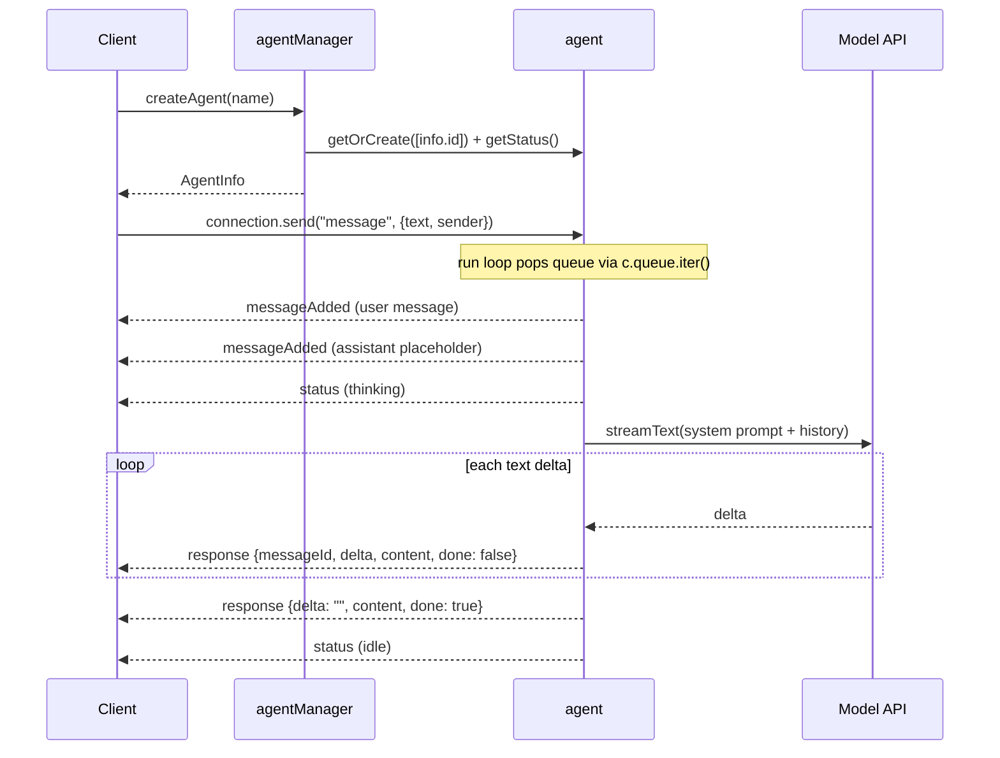

# AI Agent

**IMPORTANT: Before doing anything, you MUST read `BASE_SKILL.md` in this skill's directory. It contains essential guidance on debugging, error handling, state management, deployment, and project setup. Those rules and patterns apply to all RivetKit work. Everything below assumes you have already read and understood it.**

## Working Examples

If you need a reference implementation, read the raw working example code in these templates:

- [ai-agent](https://github.com/rivet-dev/rivet/tree/main/examples/ai-agent)

Patterns for building AI agent backends with RivetKit, where each conversation is one Rivet Actor that owns its memory, its message queue, and its streaming output.

## Starter Code

Start with one of the working examples on [GitHub](https://github.com/rivet-dev/rivet/tree/main/examples/ai-agent) and adapt it. The sections below describe the flagship `ai-agent` example unless a variant is called out explicitly.

| Variant | Starter Code | Use When |
| --- | --- | --- |
| Queue-driven AI SDK agent | [GitHub](https://github.com/rivet-dev/rivet/tree/main/examples/ai-agent) | You want a streaming chat agent where each conversation keeps its own persistent memory and processes one message at a time. |
| Sandbox coding agent | [GitHub](https://github.com/rivet-dev/rivet/tree/main/examples/sandbox-coding-agent) | The agent should run a coding agent (Codex by default) inside an isolated [sandbox](/docs/actors/sandbox) via Docker, Daytona, or E2B. |
| Durable streams agent (experimental) | [GitHub](https://github.com/rivet-dev/rivet/tree/main/examples/experimental-durable-streams-ai-agent) | You want replayable, restart-safe prompt and response delivery through durable streams instead of actor state and events. |
| Agent with a workspace (agentOS) | [GitHub](https://github.com/rivet-dev/rivet/tree/main/examples/agent-os) | The agent needs its own persistent computer: a filesystem, processes, shells, and preview URLs. See the cookbook: [AI Agent Workspaces](/cookbook/ai-agent-workspace/). |

## Conversation Memory

Use one actor per conversation, keyed by a conversation or agent id (see [Actor Keys](/docs/actors/keys)). The agent actor's persistent [state](/docs/actors/state) is the conversation memory: in the `ai-agent` example, `messages` and `status` live in JSON actor state and survive sleep and restarts with no external database. Every model call rebuilds the prompt from `c.state.messages` plus a system prompt, so memory and inference input are the same data.

| Variant | Where Memory Lives | Persisted State Fields |
| --- | --- | --- |
| `ai-agent` | JSON actor state | `messages`, `status` |
| `sandbox-coding-agent` | JSON actor state plus the sandbox ACP session | `messages`, `status`, `sessionId` |
| `experimental-durable-streams-ai-agent` | Durable streams; the actor stores only its conversation id and a read cursor | `conversationId`, `promptStreamOffset` |

## Message Handling

In the `ai-agent` example, the client pushes user input onto the agent's `message` [queue](/docs/actors/queues) with `agent.connection.send("message", { text, sender })`. This is a queue push, not an action call. The actor's `run` hook (see [Lifecycle](/docs/actors/lifecycle)) consumes the queue serially with `for await (const queued of c.queue.iter())`.

Serial queue consumption is the per-conversation concurrency guarantee: at most one in-flight model call per actor, with no extra locking. The `status` field (`thinking` while a model call is in flight) is UI signal only; the run loop is the actual lock. The loop also checks `c.aborted` inside the token stream so shutdown exits gracefully.

| Variant | Message Ingress | Serialization Guarantee |
| --- | --- | --- |
| `ai-agent` | `message` queue pushed via `connection.send` | `run` hook pops one queued message at a time with `c.queue.iter()`. |
| `sandbox-coding-agent` | `sendMessage` [action](/docs/actors/actions), no queue | Each call awaits the sandbox round trip before broadcasting the result. |
| `experimental-durable-streams-ai-agent` | Durable prompt stream long-polled from `onWake` | `promptStreamOffset` is persisted per chunk, so restarts resume without reprocessing prompts. |

## Streaming Responses

The `ai-agent` actor broadcasts a `response` [event](/docs/actors/events) for every model text delta. The payload carries `messageId`, the per-token `delta`, the cumulative `content`, and a `done` flag (plus `error` on failure), so clients can either append deltas or idempotently replace the message by `messageId` using `content`. The example frontend replaces by `messageId`, which tolerates dropped events. The terminal broadcast has an empty `delta`, the full `content`, and `done: true`.

Because the assistant message object lives in `c.state.messages` and is mutated in place during streaming, partial content persists if the actor restarts mid-stream. The example broadcasts once per AI SDK delta with no throttling; batching or throttling deltas is a recommended extension for high-traffic deployments, not something the example implements.

Variant differences: `sandbox-coding-agent` sends a single `response` broadcast with `done: true` after the sandbox finishes (no incremental streaming), and `experimental-durable-streams-ai-agent` appends per-token chunks to a durable response stream, then broadcasts `responseComplete` or `responseError`.

## Architecture

| Topic | Summary |
| --- | --- |
| Topology | `agentManager["primary"]` singleton directory plus one `agent[agentId]` actor per conversation. |
| Ingress | Client pushes `AgentQueueMessage` payloads onto the agent's `message` queue with `connection.send`. |
| Streaming | One `response` broadcast per model delta, terminal broadcast with `done: true`. |
| Memory | Full transcript and status in JSON actor state; no external database. |

The manager creates `AgentInfo` records and warms each agent through [actor-to-actor communication](/docs/actors/communicating-between-actors): `createAgent` calls `c.client<typeof registry>()`, then `client.agent.getOrCreate([info.id])` and awaits `getStatus()` so the conversation actor exists before the client connects. The sandbox variant extends this topology with a `codingSandbox` actor that shares the agent's key (`codingSandbox.getOrCreate([c.key[0]])`), so the agent-to-sandbox mapping is implicit in the key space.

**Actors**

- **Key**: `agentManager["primary"]`
- **Responsibility**: Directory actor. Creates `AgentInfo` records, lists agents, and warms each agent actor via `c.client()`.
- **Actions**
  - `createAgent`
  - `listAgents`
- **Queues**
  - None
- **State**
  - JSON
  - `agents`

- **Key**: `agent[agentId]`
- **Responsibility**: One actor per conversation. Holds the full message history and status, consumes queued user messages in its `run` loop, calls the model via the AI SDK, and broadcasts streaming deltas.
- **Actions**
  - `getHistory`
  - `getStatus`
- **Queues**
  - `message`
- **Events**
  - `messageAdded`
  - `status`
  - `response`
- **State**
  - JSON
  - `messages`
  - `status`

**Lifecycle**

## Security Checklist

The examples ship without auth so they stay minimal. Apply this baseline before exposing an agent backend.

- **API keys stay server-side**: `OPENAI_API_KEY` (or `ANTHROPIC_API_KEY`) is read by the AI SDK inside the actor process. The key never reaches the browser; clients only talk to the actor over RivetKit. The sandbox variant forwards keys into the sandbox env, never to the client.
- **Add authentication**: The examples have no auth, so anyone who reaches the server can create agents, list them, and message any agent whose key they can guess. Add `onBeforeConnect` or `createConnState` checks with scoped tokens as a recommended extension. See [Authentication](/docs/actors/authentication).
- **Validate and rate-limit queue payloads**: The example only skips bodies without a string `text`. Enforce payload size limits, schema validation, and per-connection rate limits as a recommended extension.
- **Derive sender identity server-side**: The example trusts the client-supplied `sender` field verbatim. Bind sender identity to the authenticated connection instead.
- **Cap or trim message history**: The example sends the full transcript on every model call with no cap. Trim or summarize old messages as a recommended extension so prompts and state stay bounded.
- **Set cost ceilings per conversation**: Add per-agent token budgets and quotas as a recommended extension. The sandbox variant runs real compute, so also enforce per-user sandbox quotas and restrict sandbox network egress.

## Reference Map

### Actors

- [Access Control](reference/actors/access-control.md)
- [Actions](reference/actors/actions.md)
- [Actor Keys](reference/actors/keys.md)
- [Actor Scheduling](reference/actors/schedule.md)
- [Actor Statuses](reference/actors/statuses.md)
- [AI and User-Generated Rivet Actors](reference/actors/ai-and-user-generated-actors.md)
- [Authentication](reference/actors/authentication.md)
- [Communicating Between Actors](reference/actors/communicating-between-actors.md)
- [Connections](reference/actors/connections.md)
- [Custom Inspector Tabs](reference/actors/inspector-tabs.md)
- [Debugging](reference/actors/debugging.md)
- [Design Patterns](reference/actors/design-patterns.md)
- [Destroying Actors](reference/actors/destroy.md)
- [Errors](reference/actors/errors.md)
- [Fetch and WebSocket Handler](reference/actors/fetch-and-websocket-handler.md)
- [Helper Types](reference/actors/helper-types.md)
- [Icons & Names](reference/actors/appearance.md)
- [Input Parameters](reference/actors/input.md)
- [Lifecycle](reference/actors/lifecycle.md)
- [Limits](reference/actors/limits.md)
- [Low-Level HTTP Request Handler](reference/actors/request-handler.md)
- [Low-Level KV Storage](reference/actors/kv.md)
- [Low-Level WebSocket Handler](reference/actors/websocket-handler.md)
- [Metadata](reference/actors/metadata.md)
- [Next.js Quickstart](reference/actors/quickstart/next-js.md)
- [Node.js & Bun Quickstart](reference/actors/quickstart/backend.md)
- [Queues & Run Loops](reference/actors/queues.md)
- [React Quickstart](reference/actors/quickstart/react.md)
- [Realtime](reference/actors/events.md)
- [Rust Quickstart (Preview)](reference/actors/quickstart/rust.md)
- [Sandbox Actor](reference/actors/sandbox.md)
- [Scaling & Concurrency](reference/actors/scaling.md)
- [Sharing and Joining State](reference/actors/sharing-and-joining-state.md)
- [SQLite](reference/actors/sqlite.md)
- [SQLite + Drizzle](reference/actors/sqlite-drizzle.md)
- [State & Storage](reference/actors/state.md)
- [Testing](reference/actors/testing.md)
- [Troubleshooting](reference/actors/troubleshooting.md)
- [Types](reference/actors/types.md)
- [Vanilla HTTP API](reference/actors/http-api.md)
- [Versions & Upgrades](reference/actors/versions.md)
- [Workflows](reference/actors/workflows.md)

### Agent Os

- [Agent-to-Agent Communication](reference/agent-os/agent-to-agent.md)
- [agentOS vs Sandbox](reference/agent-os/versus-sandbox.md)
- [Authentication](reference/agent-os/authentication.md)
- [Benchmarks](reference/agent-os/benchmarks.md)
- [Configuration](reference/agent-os/configuration.md)
- [Core Package](reference/agent-os/core.md)
- [Cron Jobs](reference/agent-os/cron.md)
- [Deployment](reference/agent-os/deployment.md)
- [Embedded LLM Gateway](reference/agent-os/llm-gateway.md)
- [Events](reference/agent-os/events.md)
- [Filesystem](reference/agent-os/filesystem.md)
- [Limitations](reference/agent-os/limitations.md)
- [LLM Credentials](reference/agent-os/llm-credentials.md)
- [Multiplayer](reference/agent-os/multiplayer.md)
- [Networking & Previews](reference/agent-os/networking.md)
- [Overview](reference/agent-os.md)
- [Permissions](reference/agent-os/permissions.md)
- [Persistence & Sleep](reference/agent-os/persistence.md)
- [Pi](reference/agent-os/agents/pi.md)
- [Processes & Shell](reference/agent-os/processes.md)
- [Queues](reference/agent-os/queues.md)
- [Quickstart](reference/agent-os/quickstart.md)
- [Sandbox Mounting](reference/agent-os/sandbox.md)
- [Security & Auth](reference/agent-os/security.md)
- [Security Model](reference/agent-os/security-model.md)
- [Sessions](reference/agent-os/sessions.md)
- [Software](reference/agent-os/software.md)
- [SQLite](reference/agent-os/sqlite.md)
- [System Prompt](reference/agent-os/system-prompt.md)
- [Tools](reference/agent-os/tools.md)
- [Webhooks](reference/agent-os/webhooks.md)
- [Workflow Automation](reference/agent-os/workflows.md)

### Clients

- [Node.js & Bun](reference/clients/javascript.md)
- [React](reference/clients/react.md)
- [Swift](reference/clients/swift.md)
- [SwiftUI](reference/clients/swiftui.md)

### Connect

- [Deploy To Amazon Web Services Lambda](reference/connect/aws-lambda.md)
- [Deploying to AWS ECS](reference/connect/aws-ecs.md)
- [Deploying to Cloudflare Workers](reference/connect/cloudflare.md)
- [Deploying to Freestyle](reference/connect/freestyle.md)
- [Deploying to Google Cloud Run](reference/connect/gcp-cloud-run.md)
- [Deploying to Hetzner](reference/connect/hetzner.md)
- [Deploying to Kubernetes](reference/connect/kubernetes.md)
- [Deploying to Railway](reference/connect/railway.md)
- [Deploying to Rivet Compute](reference/connect/rivet-compute.md)
- [Deploying to Supabase Functions](reference/connect/supabase.md)
- [Deploying to Vercel](reference/connect/vercel.md)
- [Deploying to VMs & Bare Metal](reference/connect/vm-and-bare-metal.md)

### Cookbook

- [AI Agent](reference/cookbook/ai-agent.md)
- [AI Agent Workspaces](reference/cookbook/ai-agent-workspace.md)
- [Chat Room](reference/cookbook/chat-room.md)
- [Collaborative Text Editor](reference/cookbook/collaborative-text-editor.md)
- [Cron Jobs and Scheduled Tasks](reference/cookbook/cron-jobs.md)
- [Database per Tenant](reference/cookbook/per-tenant-database.md)
- [Deploying Rivet in a VPC or Air-Gapped Network](reference/cookbook/vpc-air-gapped.md)
- [Live Cursors and Presence](reference/cookbook/live-cursors.md)
- [Multiplayer Game](reference/cookbook/multiplayer-game.md)

### General

- [Actor Configuration](reference/general/actor-configuration.md)
- [Architecture](reference/general/architecture.md)
- [Cross-Origin Resource Sharing](reference/general/cors.md)
- [Documentation for LLMs & AI](reference/general/docs-for-llms.md)
- [Edge Networking](reference/general/edge.md)
- [Endpoints](reference/general/endpoints.md)
- [Environment Variables](reference/general/environment-variables.md)
- [HTTP Server](reference/general/http-server.md)
- [Logging](reference/general/logging.md)
- [Pool Configuration](reference/general/pool-configuration.md)
- [Production Checklist](reference/general/production-checklist.md)
- [Registry Configuration](reference/general/registry-configuration.md)
- [Runtime Modes](reference/general/runtime-modes.md)

### Self Hosting

- [Configuration](reference/self-hosting/configuration.md)
- [Docker Compose](reference/self-hosting/docker-compose.md)
- [Docker Container](reference/self-hosting/docker-container.md)
- [File System](reference/self-hosting/filesystem.md)
- [FoundationDB (Enterprise)](reference/self-hosting/foundationdb.md)
- [Installing Rivet Engine](reference/self-hosting/install.md)
- [Kubernetes](reference/self-hosting/kubernetes.md)
- [Multi-Region](reference/self-hosting/multi-region.md)
- [PostgreSQL](reference/self-hosting/postgres.md)
- [Production Checklist](reference/self-hosting/production-checklist.md)
- [Railway Deployment](reference/self-hosting/railway.md)
- [Render Deployment](reference/self-hosting/render.md)
- [TLS & Certificates](reference/self-hosting/tls.md)

