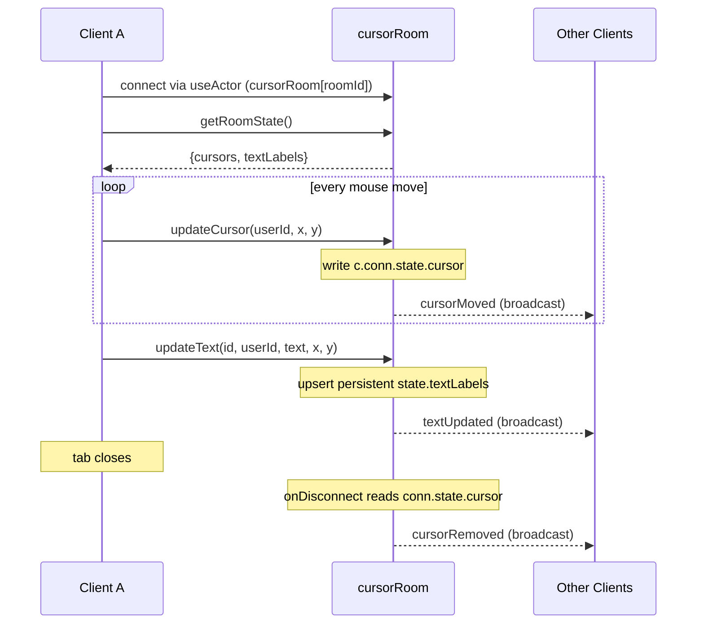
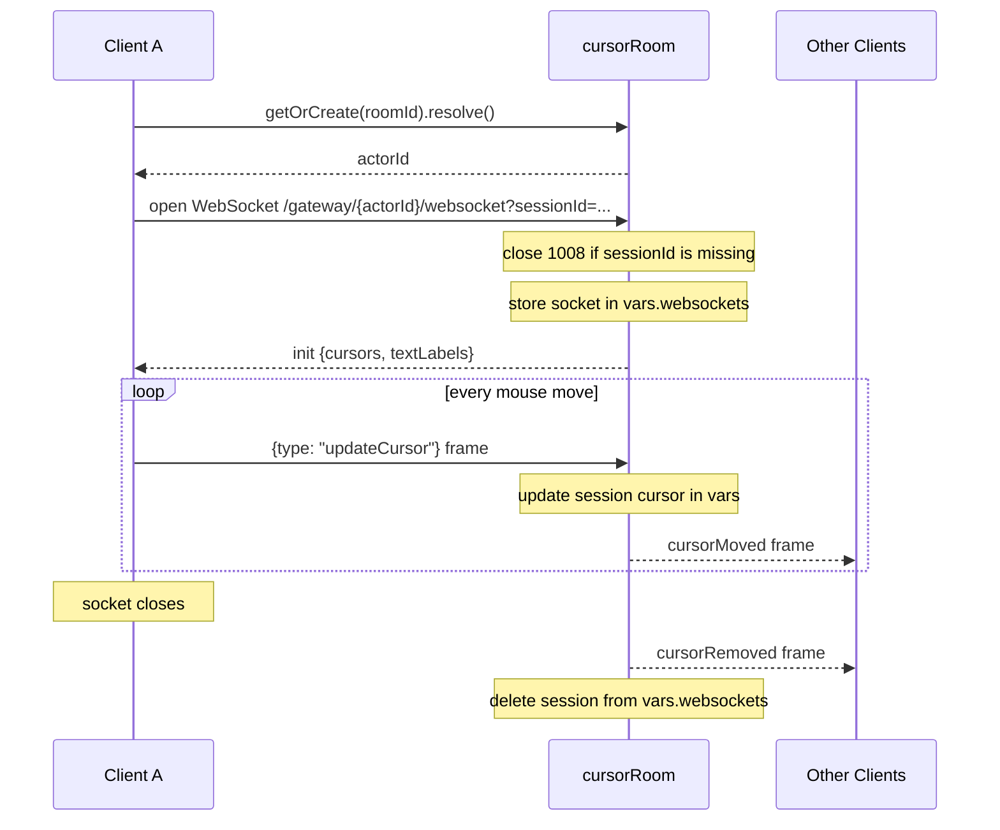

# Live Cursors and Presence

**IMPORTANT: Before doing anything, you MUST read `BASE_SKILL.md` in this skill's directory. It contains essential guidance on debugging, error handling, state management, deployment, and project setup. Those rules and patterns apply to all RivetKit work. Everything below assumes you have already read and understood it.**

## Working Examples

If you need a reference implementation, read the raw working example code in these templates:

- [cursors](https://github.com/rivet-dev/rivet/tree/main/examples/cursors)
- [cursors-raw-websocket](https://github.com/rivet-dev/rivet/tree/main/examples/cursors-raw-websocket)

Patterns for building live cursors, multiplayer presence, and realtime cursor sharing with RivetKit. One room actor fans cursor positions out to every connected client, keyed per room with [actor keys](/docs/actors/keys).

## Starter Code

Start with one of the two working variants on GitHub. Both implement the same collaborative cursor canvas with persistent text labels; they differ only in transport.

| Variant | Starter Code | Transport | Presence Storage |
| --- | --- | --- | --- |
| `cursors` | [GitHub](https://github.com/rivet-dev/rivet/tree/main/examples/cursors) | Typed [actions](/docs/actors/actions) and [events](/docs/actors/events) over the RivetKit connection | `connState` per connection |
| `cursors-raw-websocket` | [GitHub](https://github.com/rivet-dev/rivet/tree/main/examples/cursors-raw-websocket) | Raw [`onWebSocket` handler](/docs/actors/websocket-handler) with a custom JSON message protocol | Socket map in `createVars` |

Use `cursors` by default: typed actions, typed events, and automatic connection tracking cover most apps with less code. Use `cursors-raw-websocket` when you need full control of the wire format, for example a custom JSON or binary protocol, or clients that do not use the RivetKit client library.

## Connection State vs Persistent State

Presence is ephemeral by definition. A cursor position is only meaningful while its connection is alive, so it belongs in per-connection storage, not in persistent actor state. Persistent state is reserved for data that must survive disconnects and actor restarts.

| Data | Where It Lives | Why |
| --- | --- | --- |
| Cursor position | `connState` (`cursors`) or the `createVars` socket map (`cursors-raw-websocket`) | Scoped to one connection and discarded with it. Stale presence cannot accumulate in storage. |
| Text labels (`textLabels`) | Persistent actor `state` in both variants | Canvas content must survive disconnects and actor restarts. |

In the `cursors` variant, `updateCursor` writes `c.conn.state.cursor` and `getRoomState` rebuilds the presence snapshot by iterating `c.conns.values()`, so the cursor map is always derived from live connections rather than stored. See [Connections](/docs/actors/connections) for `connState` and [State](/docs/actors/state) for persistence semantics.

## Presence Lifecycle

- **Join**: The `cursors-raw-websocket` variant pushes an `init` message with the current `{ cursors, textLabels }` snapshot as soon as a socket connects. The `cursors` variant has no explicit join broadcast; the client calls the `getRoomState` action once after connecting to seed its local maps, and peers first see a new user on that user's first `cursorMoved` broadcast.
- **Move**: Every `updateCursor` call writes the connection's presence entry, then broadcasts `cursorMoved` to all connections, including the sender.
- **Leave**: The `cursors` variant handles leave in `onDisconnect`, broadcasting `cursorRemoved` with the connection's last cursor. The raw variant does the same from the socket `close` listener, then deletes the session from the `vars.websockets` map. Clients delete that user from their local cursor map, so stale cursors disappear the moment a tab closes.

See [Lifecycle](/docs/actors/lifecycle) for `onDisconnect` and `createVars`.

## Update Throttling

Neither example throttles. Both frontends send a cursor update on every raw `mousemove` event with no debounce or interval cap. That is fine for a demo, but a fast mouse on a high-refresh display can emit hundreds of events per second per user. The patterns below are recommended production hardening on top of the starter code, not something the examples implement.

| Layer | Pattern | Guidance |
| --- | --- | --- |
| Client (smoothness) | Throttle to 20-30Hz | Sample the latest pointer position every 33-50ms and send only that. Drop intermediate moves, but always flush the final position so cursors settle at the true location. Interpolate between received positions on the rendering side. |
| Server (enforcement) | Per-connection rate limit | Track the last accepted update timestamp per connection and drop or coalesce updates arriving faster than your cap. Client throttles are cooperative; the actor is the enforcement boundary. |

## Actors

- **Key**: `cursorRoom[roomId]` (the frontend defaults `roomId` to `"general"`)
- **Responsibility**: Holds per-connection cursor presence in `connState`, persists shared text labels in actor state, and broadcasts cursor and text updates to all connections.
- **Actions**
  - `updateCursor`
  - `updateText`
  - `removeText`
  - `getRoomState`
- **Events**
  - `cursorMoved`
  - `cursorRemoved`
  - `textUpdated`
  - `textRemoved`
- **Queues**
  - None
- **State**
  - JSON
  - `textLabels` (persistent)
  - `connState.cursor` per connection (ephemeral)

- **Key**: `cursorRoom[roomId]` (resolved via `client.cursorRoom.getOrCreate(roomId)`)
- **Responsibility**: Exposes a raw WebSocket endpoint, tracks live sockets and their cursors in a `createVars` map keyed by a `sessionId` query parameter, persists text labels, and manually fans JSON frames out to every socket.
- **Actions**
  - `getOrCreate` (stub returning `{ status: "ok" }`; the frontend resolves the actor ID with the client handle's `getOrCreate(roomId).resolve()`, which creates the actor without dispatching this action)
  - `getRoomState`
- **Queues**
  - None
- **State**
  - JSON
  - `textLabels` (persistent)
  - `vars.websockets` map of `sessionId` to socket and cursor (in-memory, lost on restart)

The raw variant defines no RivetKit events. Its message names are `type` fields on raw JSON frames:

| Direction | Message `type` | Payload |
| --- | --- | --- |
| Client to server | `updateCursor` | `{ userId, x, y }` |
| Client to server | `updateText` | `{ id, userId, text, x, y }` |
| Client to server | `removeText` | `{ id }` |
| Server to client | `init` | `{ cursors, textLabels }` snapshot on connect |
| Server to client | `cursorMoved`, `textUpdated`, `textRemoved`, `cursorRemoved` | The corresponding cursor, label, or ID payload |

## Lifecycle

### cursors (Actions + Events)

### cursors-raw-websocket

## Security Checklist

Both examples ship without authentication so the presence pattern stays readable. Everything below is recommended hardening for production, not behavior the examples implement.

- **Identity**: Bind presence identity to the connection (`c.conn.id` in the actions variant, a server-generated session ID in the raw variant). Never trust a client-supplied `userId`; in the examples it is a random client-generated string, so any client can impersonate or remove any cursor.
- **Authorization**: Authorize label mutations by owner. In the examples, `updateText` accepts arbitrary `id` and `userId` arguments and `removeText` accepts an arbitrary `id`, so any client can edit or delete any label.
- **Input validation**: Clamp `x` and `y` to canvas bounds, cap text label length, and cap the total `textLabels` count so persistent state cannot grow unbounded.
- **Rate limiting**: Enforce a per-connection cap on `updateCursor` (for example 30Hz) and on label writes, as described in [Update Throttling](#update-throttling).
- **Protocol strictness (raw variant)**: Validate message shape before use and close the socket on malformed JSON instead of logging and continuing. Reject duplicate `sessionId` values rather than silently overwriting another session's socket entry.

## Reference Map

### Actors

- [Access Control](reference/actors/access-control.md)
- [Actions](reference/actors/actions.md)
- [Actor Keys](reference/actors/keys.md)
- [Actor Scheduling](reference/actors/schedule.md)
- [Actor Statuses](reference/actors/statuses.md)
- [AI and User-Generated Rivet Actors](reference/actors/ai-and-user-generated-actors.md)
- [Authentication](reference/actors/authentication.md)
- [Communicating Between Actors](reference/actors/communicating-between-actors.md)
- [Connections](reference/actors/connections.md)
- [Custom Inspector Tabs](reference/actors/inspector-tabs.md)
- [Debugging](reference/actors/debugging.md)
- [Design Patterns](reference/actors/design-patterns.md)
- [Destroying Actors](reference/actors/destroy.md)
- [Errors](reference/actors/errors.md)
- [Fetch and WebSocket Handler](reference/actors/fetch-and-websocket-handler.md)
- [Helper Types](reference/actors/helper-types.md)
- [Icons & Names](reference/actors/appearance.md)
- [Input Parameters](reference/actors/input.md)
- [Lifecycle](reference/actors/lifecycle.md)
- [Limits](reference/actors/limits.md)
- [Low-Level HTTP Request Handler](reference/actors/request-handler.md)
- [Low-Level KV Storage](reference/actors/kv.md)
- [Low-Level WebSocket Handler](reference/actors/websocket-handler.md)
- [Metadata](reference/actors/metadata.md)
- [Next.js Quickstart](reference/actors/quickstart/next-js.md)
- [Node.js & Bun Quickstart](reference/actors/quickstart/backend.md)
- [Queues & Run Loops](reference/actors/queues.md)
- [React Quickstart](reference/actors/quickstart/react.md)
- [Realtime](reference/actors/events.md)
- [Rust Quickstart (Preview)](reference/actors/quickstart/rust.md)
- [Sandbox Actor](reference/actors/sandbox.md)
- [Scaling & Concurrency](reference/actors/scaling.md)
- [Sharing and Joining State](reference/actors/sharing-and-joining-state.md)
- [SQLite](reference/actors/sqlite.md)
- [SQLite + Drizzle](reference/actors/sqlite-drizzle.md)
- [State & Storage](reference/actors/state.md)
- [Testing](reference/actors/testing.md)
- [Troubleshooting](reference/actors/troubleshooting.md)
- [Types](reference/actors/types.md)
- [Vanilla HTTP API](reference/actors/http-api.md)
- [Versions & Upgrades](reference/actors/versions.md)
- [Workflows](reference/actors/workflows.md)

### Agent Os

- [Agent-to-Agent Communication](reference/agent-os/agent-to-agent.md)
- [agentOS vs Sandbox](reference/agent-os/versus-sandbox.md)
- [Authentication](reference/agent-os/authentication.md)
- [Benchmarks](reference/agent-os/benchmarks.md)
- [Configuration](reference/agent-os/configuration.md)
- [Core Package](reference/agent-os/core.md)
- [Cron Jobs](reference/agent-os/cron.md)
- [Deployment](reference/agent-os/deployment.md)
- [Embedded LLM Gateway](reference/agent-os/llm-gateway.md)
- [Events](reference/agent-os/events.md)
- [Filesystem](reference/agent-os/filesystem.md)
- [Limitations](reference/agent-os/limitations.md)
- [LLM Credentials](reference/agent-os/llm-credentials.md)
- [Multiplayer](reference/agent-os/multiplayer.md)
- [Networking & Previews](reference/agent-os/networking.md)
- [Overview](reference/agent-os.md)
- [Permissions](reference/agent-os/permissions.md)
- [Persistence & Sleep](reference/agent-os/persistence.md)
- [Pi](reference/agent-os/agents/pi.md)
- [Processes & Shell](reference/agent-os/processes.md)
- [Queues](reference/agent-os/queues.md)
- [Quickstart](reference/agent-os/quickstart.md)
- [Sandbox Mounting](reference/agent-os/sandbox.md)
- [Security & Auth](reference/agent-os/security.md)
- [Security Model](reference/agent-os/security-model.md)
- [Sessions](reference/agent-os/sessions.md)
- [Software](reference/agent-os/software.md)
- [SQLite](reference/agent-os/sqlite.md)
- [System Prompt](reference/agent-os/system-prompt.md)
- [Tools](reference/agent-os/tools.md)
- [Webhooks](reference/agent-os/webhooks.md)
- [Workflow Automation](reference/agent-os/workflows.md)

### Clients

- [Node.js & Bun](reference/clients/javascript.md)
- [React](reference/clients/react.md)
- [Swift](reference/clients/swift.md)
- [SwiftUI](reference/clients/swiftui.md)

### Connect

- [Deploy To Amazon Web Services Lambda](reference/connect/aws-lambda.md)
- [Deploying to AWS ECS](reference/connect/aws-ecs.md)
- [Deploying to Cloudflare Workers](reference/connect/cloudflare.md)
- [Deploying to Freestyle](reference/connect/freestyle.md)
- [Deploying to Google Cloud Run](reference/connect/gcp-cloud-run.md)
- [Deploying to Hetzner](reference/connect/hetzner.md)
- [Deploying to Kubernetes](reference/connect/kubernetes.md)
- [Deploying to Railway](reference/connect/railway.md)
- [Deploying to Rivet Compute](reference/connect/rivet-compute.md)
- [Deploying to Supabase Functions](reference/connect/supabase.md)
- [Deploying to Vercel](reference/connect/vercel.md)
- [Deploying to VMs & Bare Metal](reference/connect/vm-and-bare-metal.md)

### Cookbook

- [AI Agent](reference/cookbook/ai-agent.md)
- [AI Agent Workspaces](reference/cookbook/ai-agent-workspace.md)
- [Chat Room](reference/cookbook/chat-room.md)
- [Collaborative Text Editor](reference/cookbook/collaborative-text-editor.md)
- [Cron Jobs and Scheduled Tasks](reference/cookbook/cron-jobs.md)
- [Database per Tenant](reference/cookbook/per-tenant-database.md)
- [Deploying Rivet in a VPC or Air-Gapped Network](reference/cookbook/vpc-air-gapped.md)
- [Live Cursors and Presence](reference/cookbook/live-cursors.md)
- [Multiplayer Game](reference/cookbook/multiplayer-game.md)

### General

- [Actor Configuration](reference/general/actor-configuration.md)
- [Architecture](reference/general/architecture.md)
- [Cross-Origin Resource Sharing](reference/general/cors.md)
- [Documentation for LLMs & AI](reference/general/docs-for-llms.md)
- [Edge Networking](reference/general/edge.md)
- [Endpoints](reference/general/endpoints.md)
- [Environment Variables](reference/general/environment-variables.md)
- [HTTP Server](reference/general/http-server.md)
- [Logging](reference/general/logging.md)
- [Pool Configuration](reference/general/pool-configuration.md)
- [Production Checklist](reference/general/production-checklist.md)
- [Registry Configuration](reference/general/registry-configuration.md)
- [Runtime Modes](reference/general/runtime-modes.md)

### Self Hosting

- [Configuration](reference/self-hosting/configuration.md)
- [Docker Compose](reference/self-hosting/docker-compose.md)
- [Docker Container](reference/self-hosting/docker-container.md)
- [File System](reference/self-hosting/filesystem.md)
- [FoundationDB (Enterprise)](reference/self-hosting/foundationdb.md)
- [Installing Rivet Engine](reference/self-hosting/install.md)
- [Kubernetes](reference/self-hosting/kubernetes.md)
- [Multi-Region](reference/self-hosting/multi-region.md)
- [PostgreSQL](reference/self-hosting/postgres.md)
- [Production Checklist](reference/self-hosting/production-checklist.md)
- [Railway Deployment](reference/self-hosting/railway.md)
- [Render Deployment](reference/self-hosting/render.md)
- [TLS & Certificates](reference/self-hosting/tls.md)

