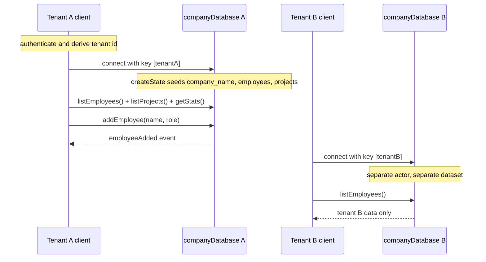

# Database per Tenant

**IMPORTANT: Before doing anything, you MUST read `BASE_SKILL.md` in this skill's directory. It contains essential guidance on debugging, error handling, state management, deployment, and project setup. Those rules and patterns apply to all RivetKit work. Everything below assumes you have already read and understood it.**

## Working Examples

If you need a reference implementation, read the raw working example code in these templates:

- [per-tenant-database](https://github.com/rivet-dev/rivet/tree/main/examples/per-tenant-database)

Patterns for database-per-tenant architectures with RivetKit. Instead of one shared database with a `tenant_id` column on every table, each tenant gets its own Rivet Actor, and that actor owns the tenant's entire dataset.

## Starter Code

Start with the working example on [GitHub](https://github.com/rivet-dev/rivet/tree/main/examples/per-tenant-database) and adapt it. The example stores each tenant's dataset in JSON actor state and serves a React dashboard with live event updates.

| Topic | Summary |
| --- | --- |
| Isolation | One `companyDatabase` actor per tenant, keyed by company name. Switching tenants swaps the entire dataset. |
| State | JSON actor state holding `employees` and `projects` arrays plus timestamps. No SQLite, no queues, no scheduling. |
| Realtime | Every write action mutates state, then broadcasts a typed event (`employeeAdded`, `projectAdded`) to all connected clients of that tenant. |
| Auth | None. The sign-in screen is cosmetic. Production guidance is in the [security checklist](#security-checklist). |

## The Isolation Model

The actor key is the tenant id. The client connects with `useActor({ name: "companyDatabase", key: [companyName] })` and the actor reads `c.key[0]` in `createState` to seed that tenant's dataset. This gives you:

- **One actor per tenant**: `companyDatabase[tenantId]` addresses exactly one actor instance. Two tenants can never share an actor.
- **One dataset per tenant**: All reads and writes go through that actor's [state](/docs/actors/state), so there is no shared table with a `tenant_id` column to filter incorrectly. Cross-tenant leaks require constructing the wrong key, not forgetting a `WHERE` clause.
- **No key injection**: Keys are arrays, not interpolated strings. `key: [tenantId]` cannot be escaped the way `"tenant:" + tenantId` string concatenation can. See [Keys](/docs/actors/keys).

The example's test ([tests/per-tenant-database.test.ts](https://github.com/rivet-dev/rivet/tree/main/examples/per-tenant-database/tests/per-tenant-database.test.ts)) proves the isolation: data written to `companyDatabase["Alpha Co"]` never appears in `companyDatabase["Beta Co"]`.

## Choosing a State Backend

The example uses plain JSON actor state. The same key-equals-tenant model works with any actor state backend.

| Backend | Use When | Docs | Working Code |
| --- | --- | --- | --- |
| JSON actor state | Small datasets, simple reads, whole dataset fits comfortably in memory. What the example uses. | [State](/docs/actors/state) | [GitHub](https://github.com/rivet-dev/rivet/tree/main/examples/per-tenant-database) |
| Actor SQLite (`rivetkit/db`) | Tables, indexes, SQL queries, larger-than-memory data, per-tenant relational schema. | [SQLite](/docs/actors/sqlite) | [GitHub](https://github.com/rivet-dev/rivet/tree/main/examples/kitchen-sink/src/actors/state/sqlite-raw.ts) |
| SQLite + Drizzle | Typed schema, query builder, and generated migration files on top of actor SQLite. | [SQLite + Drizzle](/docs/actors/sqlite-drizzle) | [GitHub](https://github.com/rivet-dev/rivet/tree/main/examples/kitchen-sink/src/actors/state/sqlite-drizzle/) |

With either SQLite option, every tenant gets its own embedded SQLite database, since the database is scoped to the actor and the actor is scoped to the tenant.

## Migrations

The per-tenant example has no migrations because JSON state has no schema. When you adopt SQLite, migrations run per tenant database:

- **Raw SQL**: `db({ onMigrate })` runs your migration SQL inside a SQLite savepoint before the actor serves traffic. If `onMigrate` throws, all migration SQL rolls back atomically and the actor does not start. See [SQLite](/docs/actors/sqlite).
- **Drizzle**: `drizzle-kit` generates migration files from your typed schema, and `db({ schema, migrations })` applies them when the actor wakes. See [SQLite + Drizzle](/docs/actors/sqlite-drizzle).

Because each tenant has its own database, migrations roll out per actor as each tenant's actor wakes, rather than as one large migration against a shared database.

## Tenant Id Must Come From Auth

The example's sign-in is cosmetic: the client picks any company string and that string becomes the actor key, so any visitor can read and write any tenant's data. Do not ship this. As a required production extension (not implemented by the example):

- Derive the tenant id from a verified credential, such as a JWT claim, never from user input.
- Validate the credential against `c.key` in `onBeforeConnect` (pass/fail) or `createConnState` (store the verified user on connection state). See [Authentication](/docs/actors/authentication) and [Connections](/docs/actors/connections).
- Add per-action permission checks on top of connection-level auth. See [Access Control](/docs/actors/access-control).

## Actors

- **Key**: `companyDatabase[companyName]` (single-element array key; `c.key[0]` is the company name)
- **Responsibility**: One actor per tenant. Holds that company's employees and projects in persistent state, serves reads and writes via actions, and broadcasts mutations to connected clients.
- **Actions**
  - `addEmployee`
  - `listEmployees`
  - `addProject`
  - `listProjects`
  - `getStats`
- **Queues**
  - None
- **Events**
  - `employeeAdded`
  - `projectAdded`
- **State**
  - JSON
  - `company_name`
  - `employees`
  - `projects`
  - `created_at`
  - `updated_at`

Every write action follows the same mutate-then-broadcast shape: push the record into `c.state`, bump `updated_at`, broadcast the typed event, return the record. See [Actions](/docs/actors/actions) and [Events](/docs/actors/events).

## Lifecycle

In the example, the "authenticate" step is a free-text company picker. The rest of the flow matches the diagram: `createState` seeds the dataset on first creation, the dashboard loads with `listEmployees`, `listProjects`, and `getStats`, and every connected client of the same tenant receives `employeeAdded` and `projectAdded` events.

## Security Checklist

The example ships with none of these. Apply all of them before production.

- **Tenant identity**: Derive the tenant id from a verified JWT claim, never from a client-supplied string.
- **Connection validation**: In `onBeforeConnect` or `createConnState`, verify the credential's tenant claim matches `c.key` and reject mismatches.
- **Per-action authorization**: Check the caller's role before mutating actions (`addEmployee`, `addProject`), not just at connect time. See [Access Control](/docs/actors/access-control).
- **Input validation**: Clamp name and role lengths and validate enums. The example only trims input and substitutes fallback defaults.
- **Key construction**: Always pass the tenant id as an array element (`key: [tenantId]`). Never interpolate tenant ids into key strings, and never build keys from one tenant's input to address another tenant's actor.
- **Growth limits**: As a recommended extension, cap or paginate the `employees` and `projects` arrays. The example lets them grow unboundedly in JSON state; move to [SQLite](/docs/actors/sqlite) when the dataset outgrows memory.

## Reference Map

### Actors

- [Access Control](reference/actors/access-control.md)
- [Actions](reference/actors/actions.md)
- [Actor Keys](reference/actors/keys.md)
- [Actor Scheduling](reference/actors/schedule.md)
- [Actor Statuses](reference/actors/statuses.md)
- [AI and User-Generated Rivet Actors](reference/actors/ai-and-user-generated-actors.md)
- [Authentication](reference/actors/authentication.md)
- [Communicating Between Actors](reference/actors/communicating-between-actors.md)
- [Connections](reference/actors/connections.md)
- [Custom Inspector Tabs](reference/actors/inspector-tabs.md)
- [Debugging](reference/actors/debugging.md)
- [Design Patterns](reference/actors/design-patterns.md)
- [Destroying Actors](reference/actors/destroy.md)
- [Errors](reference/actors/errors.md)
- [Fetch and WebSocket Handler](reference/actors/fetch-and-websocket-handler.md)
- [Helper Types](reference/actors/helper-types.md)
- [Icons & Names](reference/actors/appearance.md)
- [Input Parameters](reference/actors/input.md)
- [Lifecycle](reference/actors/lifecycle.md)
- [Limits](reference/actors/limits.md)
- [Low-Level HTTP Request Handler](reference/actors/request-handler.md)
- [Low-Level KV Storage](reference/actors/kv.md)
- [Low-Level WebSocket Handler](reference/actors/websocket-handler.md)
- [Metadata](reference/actors/metadata.md)
- [Next.js Quickstart](reference/actors/quickstart/next-js.md)
- [Node.js & Bun Quickstart](reference/actors/quickstart/backend.md)
- [Queues & Run Loops](reference/actors/queues.md)
- [React Quickstart](reference/actors/quickstart/react.md)
- [Realtime](reference/actors/events.md)
- [Rust Quickstart (Preview)](reference/actors/quickstart/rust.md)
- [Sandbox Actor](reference/actors/sandbox.md)
- [Scaling & Concurrency](reference/actors/scaling.md)
- [Sharing and Joining State](reference/actors/sharing-and-joining-state.md)
- [SQLite](reference/actors/sqlite.md)
- [SQLite + Drizzle](reference/actors/sqlite-drizzle.md)
- [State & Storage](reference/actors/state.md)
- [Testing](reference/actors/testing.md)
- [Troubleshooting](reference/actors/troubleshooting.md)
- [Types](reference/actors/types.md)
- [Vanilla HTTP API](reference/actors/http-api.md)
- [Versions & Upgrades](reference/actors/versions.md)
- [Workflows](reference/actors/workflows.md)

### Agent Os

- [Agent-to-Agent Communication](reference/agent-os/agent-to-agent.md)
- [agentOS vs Sandbox](reference/agent-os/versus-sandbox.md)
- [Authentication](reference/agent-os/authentication.md)
- [Benchmarks](reference/agent-os/benchmarks.md)
- [Configuration](reference/agent-os/configuration.md)
- [Core Package](reference/agent-os/core.md)
- [Cron Jobs](reference/agent-os/cron.md)
- [Deployment](reference/agent-os/deployment.md)
- [Embedded LLM Gateway](reference/agent-os/llm-gateway.md)
- [Events](reference/agent-os/events.md)
- [Filesystem](reference/agent-os/filesystem.md)
- [Limitations](reference/agent-os/limitations.md)
- [LLM Credentials](reference/agent-os/llm-credentials.md)
- [Multiplayer](reference/agent-os/multiplayer.md)
- [Networking & Previews](reference/agent-os/networking.md)
- [Overview](reference/agent-os.md)
- [Permissions](reference/agent-os/permissions.md)
- [Persistence & Sleep](reference/agent-os/persistence.md)
- [Pi](reference/agent-os/agents/pi.md)
- [Processes & Shell](reference/agent-os/processes.md)
- [Queues](reference/agent-os/queues.md)
- [Quickstart](reference/agent-os/quickstart.md)
- [Sandbox Mounting](reference/agent-os/sandbox.md)
- [Security & Auth](reference/agent-os/security.md)
- [Security Model](reference/agent-os/security-model.md)
- [Sessions](reference/agent-os/sessions.md)
- [Software](reference/agent-os/software.md)
- [SQLite](reference/agent-os/sqlite.md)
- [System Prompt](reference/agent-os/system-prompt.md)
- [Tools](reference/agent-os/tools.md)
- [Webhooks](reference/agent-os/webhooks.md)
- [Workflow Automation](reference/agent-os/workflows.md)

### Clients

- [Node.js & Bun](reference/clients/javascript.md)
- [React](reference/clients/react.md)
- [Swift](reference/clients/swift.md)
- [SwiftUI](reference/clients/swiftui.md)

### Connect

- [Deploy To Amazon Web Services Lambda](reference/connect/aws-lambda.md)
- [Deploying to AWS ECS](reference/connect/aws-ecs.md)
- [Deploying to Cloudflare Workers](reference/connect/cloudflare.md)
- [Deploying to Freestyle](reference/connect/freestyle.md)
- [Deploying to Google Cloud Run](reference/connect/gcp-cloud-run.md)
- [Deploying to Hetzner](reference/connect/hetzner.md)
- [Deploying to Kubernetes](reference/connect/kubernetes.md)
- [Deploying to Railway](reference/connect/railway.md)
- [Deploying to Rivet Compute](reference/connect/rivet-compute.md)
- [Deploying to Supabase Functions](reference/connect/supabase.md)
- [Deploying to Vercel](reference/connect/vercel.md)
- [Deploying to VMs & Bare Metal](reference/connect/vm-and-bare-metal.md)

### Cookbook

- [AI Agent](reference/cookbook/ai-agent.md)
- [AI Agent Workspaces](reference/cookbook/ai-agent-workspace.md)
- [Chat Room](reference/cookbook/chat-room.md)
- [Collaborative Text Editor](reference/cookbook/collaborative-text-editor.md)
- [Cron Jobs and Scheduled Tasks](reference/cookbook/cron-jobs.md)
- [Database per Tenant](reference/cookbook/per-tenant-database.md)
- [Deploying Rivet in a VPC or Air-Gapped Network](reference/cookbook/vpc-air-gapped.md)
- [Live Cursors and Presence](reference/cookbook/live-cursors.md)
- [Multiplayer Game](reference/cookbook/multiplayer-game.md)

### General

- [Actor Configuration](reference/general/actor-configuration.md)
- [Architecture](reference/general/architecture.md)
- [Cross-Origin Resource Sharing](reference/general/cors.md)
- [Documentation for LLMs & AI](reference/general/docs-for-llms.md)
- [Edge Networking](reference/general/edge.md)
- [Endpoints](reference/general/endpoints.md)
- [Environment Variables](reference/general/environment-variables.md)
- [HTTP Server](reference/general/http-server.md)
- [Logging](reference/general/logging.md)
- [Pool Configuration](reference/general/pool-configuration.md)
- [Production Checklist](reference/general/production-checklist.md)
- [Registry Configuration](reference/general/registry-configuration.md)
- [Runtime Modes](reference/general/runtime-modes.md)

### Self Hosting

- [Configuration](reference/self-hosting/configuration.md)
- [Docker Compose](reference/self-hosting/docker-compose.md)
- [Docker Container](reference/self-hosting/docker-container.md)
- [File System](reference/self-hosting/filesystem.md)
- [FoundationDB (Enterprise)](reference/self-hosting/foundationdb.md)
- [Installing Rivet Engine](reference/self-hosting/install.md)
- [Kubernetes](reference/self-hosting/kubernetes.md)
- [Multi-Region](reference/self-hosting/multi-region.md)
- [PostgreSQL](reference/self-hosting/postgres.md)
- [Production Checklist](reference/self-hosting/production-checklist.md)
- [Railway Deployment](reference/self-hosting/railway.md)
- [Render Deployment](reference/self-hosting/render.md)
- [TLS & Certificates](reference/self-hosting/tls.md)

