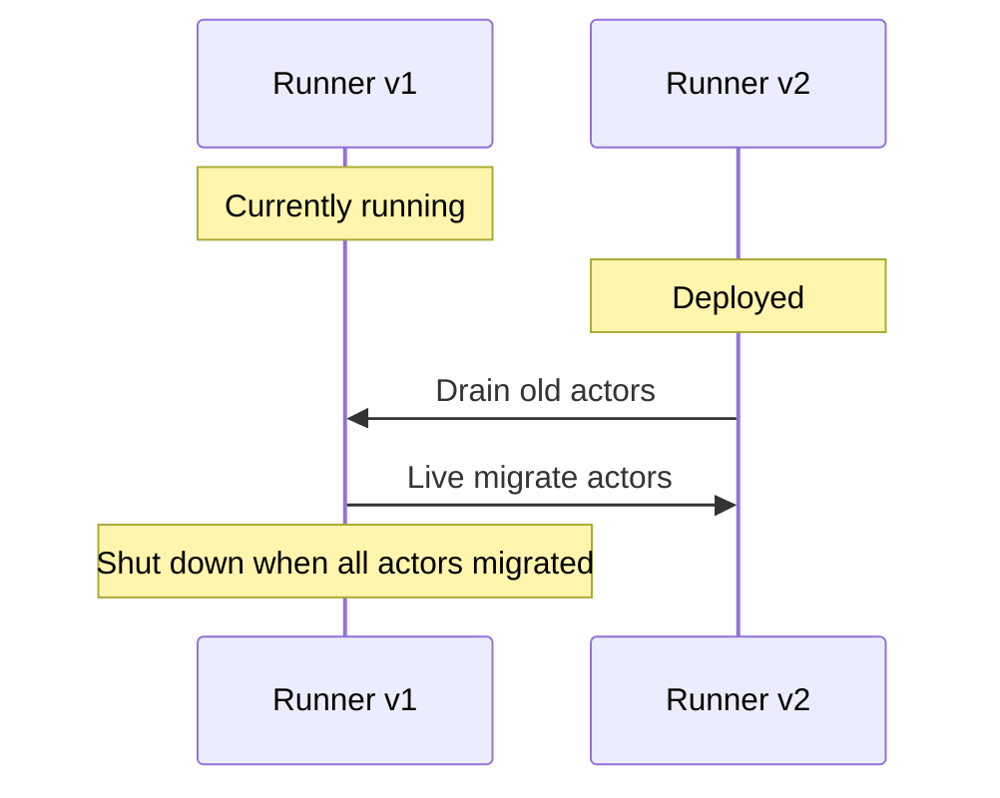
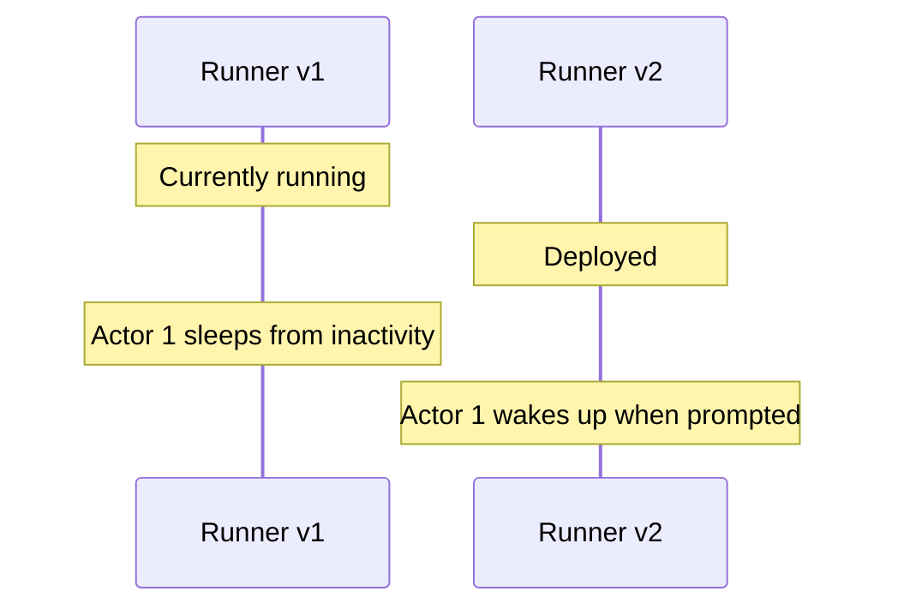

# Versions & Upgrades

> Source: `src/content/docs/actors/versions.mdx`
> Canonical URL: https://rivet.gg/docs/actors/versions
> Description: When you deploy new code, Rivet ensures actors are upgraded seamlessly without downtime.

---
## How Versions Work

Each runner has a **version number**. When you deploy new code with a new version, Rivet handles the transition automatically:

- **New actors go to the newest version**: When allocating actors, Rivet always prefers runners with the highest version number
- **Multiple versions can coexist**: Old actors continue running on old versions while new actors are created on the new version
- **Drain old actors**: When enabled, a runner connecting with a newer version number will gracefully stop old actors to be rescheduled to the new version

Versions are not configured by default. See [Registry Configuration](/docs/connect/registry-configuration) to learn how to configure the runner version.

### Example Scenario

### Drain Enabled

When a new version is deployed, existing actors are immediately drained from the old runner and live migrated to the new version.



### Drain Disabled

When a new version is deployed, both versions coexist. New actors are created on the new version while existing actors continue running on the old version until.



## Configuration

### Setting the Version

Configure the runner version using an environment variable or programmatically:

```bash {{"title": "Environment Variable"}}
RIVET_RUNNER_VERSION=2
```

```typescript {{"title": "Programmatic"}}
import { actor, setup } from "rivetkit";

const myActor = actor({ state: {}, actions: {} });

const registry = setup({
  use: { myActor },
  runner: {
    version: 2,
  },
});
```

We recommend injecting a value at built time that increments every deployment, such as:

- Build timestamp
- Git commit number (`git rev-list --count HEAD`)
- CI build number ([`github.run_number`](https://docs.github.com/en/actions/reference/workflows-and-actions/contexts#:~:text=github%2Erun%5Fnumber))

### Drain on Version Upgrade

The `drainOnVersionUpgrade` option controls whether old actors are stopped when a new version is deployed. This is configured in the Rivet dashboard under your runner configuration.

| Value | Behavior |
|-------|----------|
| `false` (default) | Old actors continue running. New actors go to new version. Versions coexist. |
| `true` | Old actors receive stop signal and have 30s to finish gracefully. |

## Advanced

### How Version Upgrade Detection Works

When `drainOnVersionUpgrade` is enabled, Rivet uses two mechanisms to detect version changes:

**New Runner Connection**

When a runner connects with a newer version number, the engine immediately drains all older runners with the same name. This is the primary mechanism for [runner mode](/docs/general/runtime-modes) deployments. In serverless mode, this also provides faster upgrades if a new request arrives before the next metadata poll interval.

**Metadata Polling** (Serverless Only)

In [serverless mode](/docs/general/runtime-modes), runners poll the engine's metadata endpoint periodically to check for newer versions. If a newer version is detected, the runner initiates a self-drain. This is necessary because serverless functions may continue handling requests without reconnecting after a new deployment. Polling ensures old runners eventually drain even if no new requests trigger a runner connection.

## Related

- [Runtime Modes](/docs/general/runtime-modes): Serverless vs runner deployment modes
- [Lifecycle](/docs/actors/lifecycle): Actor lifecycle hooks including `onSleep`

_Source doc path: /docs/actors/versions_
