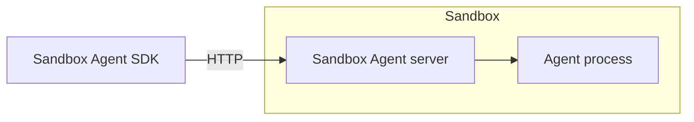
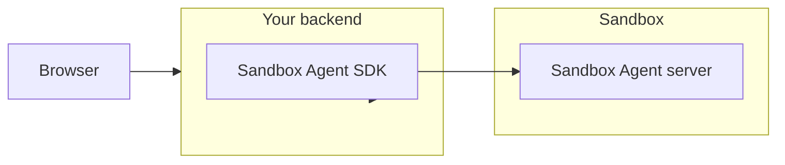

# Architecture

> Source: `docs/architecture.mdx`
> Canonical URL: https://sandboxagent.dev/docs/architecture
> Description: How the client, sandbox, server, and agent fit together.

---
Sandbox Agent runs as an HTTP server inside your sandbox. Your app talks to it remotely.

## Components

- `Your client`: your app code using the `sandbox-agent` SDK.
- `Sandbox`: isolated runtime (E2B, Daytona, Docker, etc.).
- `Sandbox Agent server`: process inside the sandbox exposing HTTP transport.
- `Agent`: Claude/Codex/OpenCode/Amp process managed by Sandbox Agent.

## Suggested Topology

Run the SDK on your backend, then call it from your frontend.

This extra hop is recommended because it keeps auth/token logic on the backend and makes persistence simpler.

### Backend requirements

Your backend layer needs to handle:

- **Long-running connections**: prompts can take minutes.
- **Session affinity**: follow-up messages must reach the same session.
- **State between requests**: session metadata and event history must persist across requests.
- **Graceful recovery**: sessions should resume after backend restarts.

We recommend [Rivet](https://rivet.dev) over serverless because actors natively support the long-lived connections, session routing, and state persistence that agent workloads require.

## Session persistence

For storage driver options and replay behavior, see [Persisting Sessions](/session-persistence).
